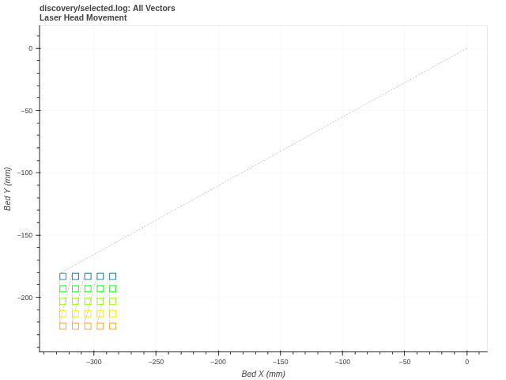

# RPA — Ruida Protocol Analyzer

A comprehensive Python-based protocol analyzer for analyzing Ruida CNC controller communications. This tool parses network packet captures from tshark/Wireshark to decode and interpret the binary Ruida protocol used in laser cutters, engravers, and CNC machines.

NOTE: This is a project which is rapidly evolving. New features and changes are added almost daily. If you clone or fork this project you may want to update regularly. Once all planned features have been added a more controlled release process will be used.

## Features

- **File-based Analysis**: Process existing tshark capture files
- **State Machine Parser**: Robust parsing using a finite state machine architecture
- **Hierarchical Commands**: Handles nested command structures (command/subcommand)
- **Type-aware Parameters**: Decodes coordinates, power levels, speeds, and other data types
- **Flexible Output**: Console output, file output, verbose modes, and raw packet display
- **Error Handling**: Configurable error handling with resync capabilities
- **Move and Cut Plotting**: When enabled moves and cut lines are plotted using Bokeh
- **Automation-friendly**: `rpa.py` accepts a tshark log file and produces structured, text-based output suitable for scripting, pipelines, and CI/CD systems.
- **Script Generation and Plot Export**: `--generate-rd` and `--save-plot` flags for binary `.rd` output and headless HTML plot export

This tool is designed to be used to discover and diagnose problems related to UDP communications with a Ruida controller. Much of the Ruida protocol is unknown and new commands or parameters may be discovered during analysis. The nature of such discovery often requires new experiments or parsing algorithms when new information is learned. Because of this the best experience using this tool is within VSCode or its forks like VSCodium and Antigravity. These IDEs allow stepping through the code to observe the analyzer's behavior along with side by side display of moves and cuts. And, when needed, this tool can be hacked to refine analysis. If you create a hack which can be useful to others please consider contributing it to this project.

## Background

The Ruida protocol is a proprietary binary communication protocol used by Ruida CNC controllers, commonly found in:
- CO2 laser cutters and engravers
- Fiber laser systems
- CNC routers with Ruida controllers
- Industrial cutting and marking systems

This analyzer was developed to understand and document the protocol for research, debugging, and integration purposes.

This tool is laser-focused on the Ruida protocol only.

## Requirements

- Python 3.7+
- Wireshark/tshark installed and accessible in PATH
- Network access to capture Ruida controller communications

## Installation

### Option 1: Install from source (recommended for development)

```bash
git clone https://github.com/StevenIsaacs/ruida-rpa.git
cd ruida-rpa

# Create and activate a virtual environment
python -m venv .venv
source .venv/bin/activate  # On Windows: .venv\Scripts\activate

# Install the package in editable mode
pip install -e .

# For plotting support:
pip install -e ".[plotting]"
```

### Option 2: Direct install from source

```bash
pip install git+https://github.com/StevenIsaacs/ruida-rpa.git
```

After installation, the `rpa` command is available globally (when the venv is active):
```bash
rpa --help
```
The `rpa-script` command (script interpreter/playback) is also installed:

```bash
rpa-script --help
```

### Requirements

- Python 3.7+
- Wireshark/tshark installed and accessible in PATH
- Network access to capture Ruida controller communications

### Building a Standalone Binary

A standalone binary (no Python required) can be built with PyInstaller:

```bash
# Linux
./build.sh

# Windows (PowerShell)
.\build.ps1

# The binary is placed in dist/
./dist/rpa --help
```

Requirements: PyInstaller (`pip install pyinstaller`) and a working build environment (gcc/clang on Linux, Visual Studio on Windows).

## Usage

**Note:** When running from source code, make sure to activate your Python virtual environment first:
```bash
source .venv/bin/activate  # On Windows: .venv\Scripts\activate
```

### Capture Traffic with tshark

First, capture Ruida protocol traffic using tshark. Replace `<ruida_ip>` with your controller's IP address:

```bash
tshark -Y "(ip.addr == <ruida_ip> && udp.payload)" -T fields \
       -e frame.time_delta -e udp.port -e udp.length -e data.data > capture.log
```

### Analyze Captured Data

#### Basic Analysis
```bash
python rpa.py capture.log
```

`.rd` — RDWorks binary files can be decoded directly.

#### Advanced Options
```bash
# Verbose output with raw packet data
python rpa.py --verbose --raw capture.log

# Save decoded output to file
python rpa.py -o decoded.txt capture.log

# Quiet mode, stop on first error
python rpa.py --quiet --stop-on-error -o results.txt capture.log

# Generate .rds script and .rd binary output
python rpa.py --generate-rd capture.log

# Generate .rd binary from an existing .rds script
python rpa.py script.rds

# Save interactive plot as standalone HTML
python rpa.py --save-plot capture.log

# Decode a binary .rd file directly
python rpa.py capture.rd
```

## Command Line Options

| Option | Description |
|--------|-------------|
| `--bokeh-port <port>` | Set the Bokeh server port for `--plot-moves` (default: 5006). |
| `--generate-rd` | Generate a binary `.rd` file from the decoded commands. Auto-enables `--generate-script` for `.log`/`.txt` input. For `.rd` input, appends `-reencoded` suffix to avoid overwriting. |
| `--generate-script` | Generate a `.rds` Ruida Script file from the decoded commands. Combined with `-o <file>` to control the output path. |
| `--magic <magic_number>` | Specify the swizzle magic number rather than attempt to discover it in the capture. |
| `--out <file>`, `-o <file>` | Write decoded data to specified file. |
| `--plot-moves` | Plot head moves and cuts. This also displays power and speed settings. |
| `--quiet`, `-q` | Suppress stdout output. |
| `--raw` | Include raw packet dumps with decoded output. |
| `--save-plot` | Save the interactive plot as a standalone HTML file instead of opening a Bokeh server. Produces `{stem}[-{ext}]-view.html`. |
| `--stop-on-error` | Stop processing on first decode error. |
| `--unswizzled` | Output the unswizzled and unprocessed data. |
| `--verbose` | Generate detailed output with additional information. |

### Interactive TUI (Terminal User Interface)

For detailed documentation of the TUI, including session management,
script execution, capture import, visualization, and all slash commands:

**[docs/guides/tui-guide.md](docs/guides/tui-guide.md)**

Quick start:

```bash
rpa-script
```

The TUI provides interactive access to Ruida controllers via terminal,
combining connection management, script execution, real-time monitoring,
and capture import from other laser applications.

### Crash Handling

If an unhandled exception occurs, a persistent error screen displays the
traceback with Rich formatting. Press any key to exit the TUI.

## Script Generation & Round-Trip Testing

`rpa-script` is a script interpreter that plays back Ruida Script (`.rds`) files and
generates tshark-format binary output. Combined with `rpa --generate-script`, this
enables round-trip testing: capture → decode → script → tshark → re-decode.

### Generating Scripts from Captures

Use `--generate-script` to produce both a `.txt` decode file and a `.rds` script file:

```bash
python rpa.py --generate-script -o output.txt capture.log
```

This produces `output.txt` (human-readable decode) and `output.rds` (script file).
If `-o` is omitted, the script file is named after the input file (e.g. `capture.rds`).

The generated `.rds` includes:
- A `# Source:` header tracking the original capture filename
- `# Packet N` comments at each packet boundary
- Reply values captured from controller responses (e.g. `CardID:RDC6442S`)

### Playing Back Scripts

Convert a `.rds` script to tshark-format binary output:

```bash
# Output to stdout (pipe directly to rpa for decoding)
rpa-script script.rds | python rpa.py -

# Output to file
rpa-script script.rds -o output.tshark
```

### Full Round-Trip Workflow

Use the `.rds` file as input to `rpa-script` to regenerate tshark packets,
then re-decode them to verify round-trip fidelity:

```bash
# Step 1: Decode and generate script
python rpa.py --generate-script capture.log

# Step 2: Play back the script to regenerate packets
rpa-script capture.rds -o capture-rt.tshark

# Step 3: Re-decode the generated packets
python rpa.py -o capture-rt.txt capture-rt.tshark

# Step 4: Compare the original and round-trip decode files
diff <(grep '^[0-9]' capture.txt) <(grep '^[0-9]' capture-rt.txt)
```

### Generating Binary `.rd` Files

Use `--generate-rd` to produce a binary `.rd` file alongside the decode output:

```bash
python rpa.py --generate-rd -o output capture.log
```

This produces `output.txt` (decode), `output.rds` (script), and `output.rd` (binary). If `-o` is omitted, the `.rd` file is named after the input file.

For `.rds` input, `.rd` output is generated directly without decode:

```bash
python rpa.py script.rds     # Produces script.rd
```

For `.rd` input, `--generate-rd` re-encodes with a `-reencoded` suffix to avoid overwriting:

```bash
python rpa.py --generate-rd capture.rd    # Produces capture-reencoded.rd
```

The `--magic` flag controls the swizzle byte (default `0x88`).

### `.rds` Script Format

Ruida Script (`.rds`) files are line-oriented text files. Each line contains
a command mnemonic followed by optional parameters and an optional expected reply:

```rds
# Source: capture.log

# Packet 1
GET_SETTING MEM_CARD_ID  = CardID:RDC6442S

# Packet 2
NEW_PACKET
REF_POINT_2
SET_ABSOLUTE
MOVE_ABS_XY X=10000mm Y=20000mm
```

- Lines starting with `#` are comments
- `NEW_PACKET` marks a boundary between packets
- `= value` after a command captures the controller's reply
- Packet numbering comments (`# Packet N`) provide human-readable guidance

## Output Format

The analyzer produces human-readable output showing:
- Timestamp and packet information
- Decoded command names
- Parameter values with appropriate units
- Error messages for malformed packets

Where (see example):
- pkt_n = Current packet number
- cmd_n = Current command number for all commands in the captured session
- msg_n = Message number in the current command
- dir   = --> or <-- or ---(below)
- take  = Buffer take index
- remaining = Number of bytes remaining in the buffer
- checksum = The calculated file checksum
- msg_class = Message classes can be either:
  - PRT = Protocol related
  - INT = Internal engine related
- msg_type = The message type.
  - For protocol messages:
    - RDR = Packet reader
    - PRS = Data parser
    - SHK = Message handshake
    - ERR = Errors with parsing or incoming data
    - FTL = Fatal errors (will trigger an exit)
    - vrb = Verbose message (when --verbose is used)
    - raw = Raw tshark and unswizzled packets or other raw data.
    - --- = Packet direction not determined
    - --> = Packets from the host
    - <-- = Packets from the controller
  - For internal messages:
    - PRT = An error caused by a protocol specification
    - INF = Information only
    - WRN = A warning about a correctable error
    - CRT = A critical error -- will continue to run
    - FTL = A fatal error which triggers an exit

Typical messages have the format:
```
<pkt_n>:<cmd_n>:<msg_n>:<msg_type>:<message>
```
Decoded output has the format:
```
<pkt_n>:<cmd_n>:<msg_n>:PRT:PRS:<dir>:T=<take> R=<remaining> SUM=<checksum>
```

There may be times when the amount of time between packets is important when
diagnosing a problem. The time between packets in the log file is indicated as:
```
0003:000001:023:PRT:RDR:<--:Interval:0.000071S
```

## File Checksum

The end of a file sent to the controller ends with a SET_FILE_SUM command
which includes the checksum calculated by the host. It is assumed the
controller then compares the host's checksum with its internally calculated
checksum. If the sums do not match the controller may display a message
indicating the failure.

RPA also calculates a checksum and compares its result with the SET_FILE_SUM
checksum. If they do not match an ERR message is emitted. e.g.:
```
0228:030441:004:PRT:ERR:-->:Checksum mismatch:
    decoded=9763961
accumulated=9756933
difference =7028
```

It is currently believed the checksum is a simple sum of all the bytes
in commands related to engraving and cutting.

Excluded commands include:
- Any commands related to getting or setting controller memory locations
- Controller keyboard commands (e.g. jogging button presses)

NOTE: It is currently unclear as to which bytes are to be included in the
checksum calculation. Using LightBurn captures there is currently a consistent
discrepancy of 220 (shown as a difference). This implies there are only one or
two bytes missing from the calculation -- at least for LightBurn captures.

## Example Output

### Normal Verbose Output
```
0001:000001:003:PRT:RDR:---:Interval:-0.000101S
0001:000001:004:PRT:raw:-->:
Sep 25, 2025 22:33:40.474975135 PDT	40200,50200	14	0261d4890df7

0001:000001:005:PRT:raw:-->:
da00057e
0001:000001:006:PRT:RDR:-->:SHK:001:Expecting ACK
0001:000001:007:vrb:Exiting state: sync
0001:000001:008:vrb:Entering state: expect_sub_command
0001:000001:009:vrb:Exiting state: expect_sub_command
0001:000001:010:vrb:Entering state: decode_parameters
0001:000001:011:vrb:Priming: ('Addr:{:04X}', 'mt', 'mt')
0001:000001:012:vrb:Decoding parameter 1.
0001:000001:013:vrb:Decoded parameter 1=Addr:057E:Card ID.
0001:000001:014:vrb:Exiting state: decode_parameters
0001:000001:015:vrb:Entering state: mt_command
0001:000001:016:PRT:PRS:-->:T=0004 R=0000 SUM=00000000:
GET_SETTING Addr:057E:Card ID

0001:000001:017:vrb:-->:da00057e
0001:000001:018:vrb:<--:
0002:000001:019:PRT:RDR:-->:Interval:0.000101S
0002:000001:020:PRT:raw:<--:
Sep 25, 2025 22:33:40.475076666 PDT	50200,40200	9	c6

0002:000001:021:PRT:raw:<--:
cc
0002:000001:022:PRT:RDR:<--:SHK:000:ACK
```

### Unknown Data Output
All unknowns are marked with "TBD". These can be either newly discovered commands
or addresses or unknown data formats for previously discovered commands or
addresses. This indicates data which requires further investigation.

Unknown parameter values are output in binary, hex, and decimal.
```
0010:000393:001:INT:---:Next command...
0010:000393:002:vrb:Checksum: disabled
0010:000393:003:vrb:Checksum: ENABLED
0010:000393:004:vrb:Exiting state: expect_command
0010:000393:005:vrb:Entering state: expect_sub_command
0010:000393:006:vrb:Exiting state: expect_sub_command
0010:000393:007:vrb:Entering state: decode_parameters
0010:000393:008:vrb:Priming: ('\nTBD:{0:035b}b: 0x{0:08x}: {0}', 'tbd', 'tbd')
0010:000393:009:vrb:Decoding parameter 1.
0010:000393:010:vrb:Forwarding 0xEA to state sync
0010:000393:011:vrb:Exiting state: decode_parameters
0010:000393:012:vrb:Entering state: sync
0010:000393:013:PRT:PRS:-->:T=0270 R=0741 SUM=00176437:
FEED_INFO:
TBD:00000000000000000000000000000000000b: 0x00000000: 0

0010:000393:014:vrb:-->:e70a0000000000ea
0010:000393:015:vrb:<--:
```

### Checksum Message
The file checksum message triggers the following message sequence. The
checksum message itself is NOT included in the checksum.
```
0228:030440:006:vrb:Checksum: disabled
0228:030440:007:vrb:Backed out: [229, 5]
0228:030440:008:vrb:Exiting state: expect_sub_command
0228:030440:009:vrb:Entering state: decode_parameters
0228:030440:010:vrb:Priming: ('Sum:0x{0:010X} ({0})', 'checksum', 'uint_35')
0228:030440:011:vrb:Decoding parameter 1.
0228:030440:012:vrb:Decoded parameter 1=Sum:0x000094FC79 (9763961).
0228:030440:013:vrb:Parameters decoded.
0228:030440:014:vrb:Exiting state: decode_parameters
0228:030440:015:vrb:Entering state: expect_command
0228:030440:016:PRT:PRS:-->:T=0925 R=0001 SUM=09756933:
SET_FILE_SUM Sum:0x000094FC79 (9763961)

0228:030440:017:vrb:-->:e5050004537879
0228:030440:018:vrb:<--:
0228:030441:001:INT:---:Next command...
0228:030441:002:vrb:Checksum: disabled
0228:030441:003:vrb:Checksum: ENABLED
0228:030441:004:PRT:ERR:-->:Checksum mismatch:
    decoded=9763961
accumulated=9756933
difference =7028

```

### Move Plotting
When move plotting is enabled an interactive Bokeh visualization is opened
in a browser window showing all individual head moves. Hovering over a line
will display a tooltip showing the move command ID, end point coordinates,
length, power, and speed. The visualization supports filtering by move type
(moves/cuts), power range, and speed range. Right-click on any vector for
context menu options including opening a new tab filtered from that command.



## Protocol Structure

The Ruida protocol uses a hierarchical binary command structure:

- **Single Commands**: Direct command byte followed by parameters
- **Hierarchical Commands**: Command byte + subcommand byte + parameters
- **Parameters**: Type-specific encoding (coordinates, power, speed, etc.)

### Supported Parameter Types

- **Coordinates**: Absolute and relative positioning in micrometers
- **Power Values**: Laser power percentages
- **Speed Values**: Movement speeds in micrometers/second
- **Time Values**: Delays and timing in microseconds
- **Control Values**: Various machine control parameters

## Architecture

The analyzer uses a finite state machine with the following states:
- `IDLE`: Ready for new packet
- `COMMAND_BYTE`: Processing main command
- `SUBCOMMAND_BYTE`: Processing hierarchical subcommands
- `PARAMETER_PARSING`: Extracting typed parameters
- `ERROR`: Handling parse failures

## Contributing

Contributions are welcome! This is an ongoing analysis project. Areas where help is needed:

- **Protocol Documentation**: Adding new command interpretations
- **Parameter Types**: Implementing additional data type decoders
- **Testing**: Validating against different Ruida controller models
- **Features**: Additional analysis and export capabilities

### Adding New Protocol Specificatons

Protocol specifications are defined in the protocol tables. For example:
```python
# In CT (Command Table)
0x88: ('MOVE_ABS_XY', XCOORD, YCOORD),
```

Parameter decoders are defined as tuples:
```python
XCOORD = ('X={}mm', coord, 'int_35')
#         ^format   ^decoder ^raw_type
```

## License

This project is released under the MIT License. See [LICENSE](LICENSE) for details.

## Disclaimer

This tool is for educational and research purposes. The Ruida protocol is proprietary, and this analyzer is based on analysis of network traffic. Use responsibly and respect intellectual property rights.

## Acknowledgments

- Developed for understanding Ruida CNC/laser cutter communications
- Inspired by the need for open tools in the CNC/laser space
- Built with insights from the embedded systems and maker communities

### Sources

 - MeerK40T: https://github.com/meerk40t/meerk40t/tree/main/meerk40t/ruida
 - Ruida protocol: https://edutechwiki.unige.ch/en/Ruida

## Support

- **Issues**: Please report bugs and feature requests via GitHub issues
- **Discussions**: Use Discord or GitHub discussions for questions and protocol insights
- **Documentation**: Help improve protocol documentation through pull requests

---

**Note**: This analyzer is a work in progress. Protocol coverage is incomplete, and new command interpretations are added as they're discovered and validated.
