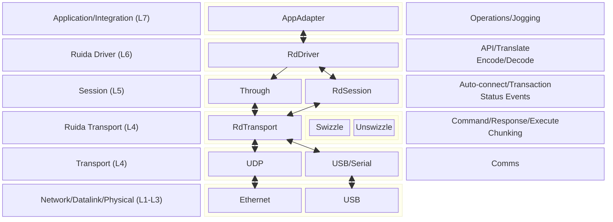
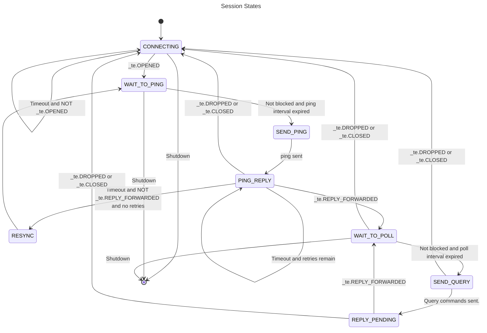
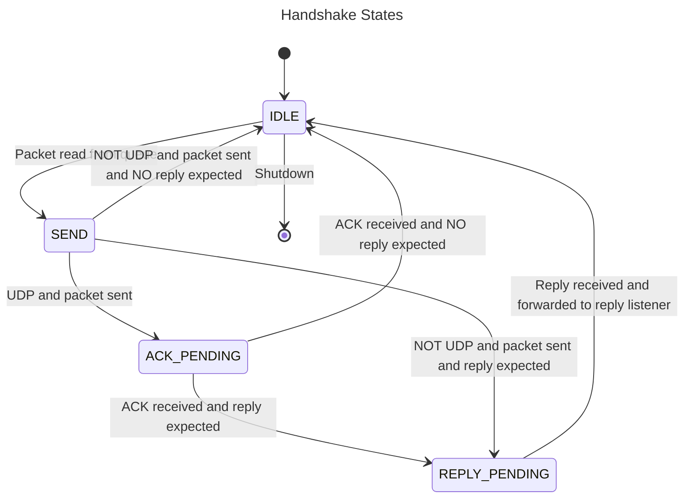

# AGENTS
These are specific to the RuidaDriver planning and implementation.

Because LLMs are not properly trained for the nuances of the Ruida protocol, the Controller, Connect, Status and Ruida Protocol components are manually developed with the exception of some relatively small and specific tasks which will employ AI agent assistance using task specific prompts. 

**IMPORTANT:** Agents, therefore, should not modify this document or perform any of the tasks unless specifically prompted to do so.
All file references are relative to the project directory (current working directory).

Testing will utilize the `rpa-script` which was implemented as part of the `docs/plans/ProtocolDiscoveryTools-plan.md` plan. More detail is provided in the Testing section of this document.

All test code for the RuidaDriver should be saved in `ruidadriver/test`.

In the following the pattern **AGENT:** indicates something to be included in a layer's implementation plan.
# Introduction
This document provides an overview of the Ruida Driver. Described are overall structure, and Ruida idiosyncrasies and how they are handled. This is to be implemented using Python. To that end classes and their corresponding APIs are also described in this document.

NOTE: Currently only the X and Y axes are supported. The code is tested using a Ruida RDC6442S controller. Behavior with other controllers is unknown at this time even though many should work as well -- providing the correct swizzle magic number is used.

**This document is concerned with layers L4 thru L7 shown in the Structure diagram. Layers L1-L3 are shown for reference and are OS defined.**

This is a living document meaning it will be updated as necessary during implementation.
# Architecture
This driver conforms, in large part, to the OSI communications model and is structured as follows:

NOTE: Data paths are shown. For simplicity, control and status paths are not shown.
# Interfaces
## Application/Integration (L7)
This layer represents components needed to integrate the Ruida Driver with an application such as `rpa-script` (Ruida scripting utility) or an application such as [MeerK40t](https://github.com/meerk40t/meerk40t) or [Rayforge](https://github.com/barebaric/rayforge).  The application developer is responsible for implementing the application specific Adapter.
### Application Facing API
The application calls the Adapter using an Application defined API which converts application specific calls and data formats to a Ruida script (see `rpascript`) then passes the script to the Ruida Driver to be interpreted and sent to the Ruida controller.
### Events and Reply Data Listening
The Adapter registers a `RdDriver` listener to receive decoded reply data. The Adapter then converts these into Application compatible signals and data formats and forwards them to the application using Application defined methods.
### Threading Differences
The Adapter is also responsible for dealing with the differences in threading models between the Application and the Ruida Driver. For example: Internally the Ruida Driver uses the Python `threading` package for preemptive threading whereas the Application may use the `asyncio` package for cooperative threading. The Adapter uses either threading model when needed. `threading` signals are forwarded to the Application as `asyncio` signals if necessary.
### The TuiAdapter Class -- rpascript/tui_adapter.py
This is to allow using `rpa-script` to generate command lists which can be used for live testing the implementation of this design and later discovery of Ruida controller behavior using live sessions.
#### User Interface
The `TuiAdapter` creates a Terminal User Interface (TUI) using [Textualize/textual](https://github.com/textualize/textual/) This is used to display status and reply data as well as support user interaction.

The TUI layout will be similar in appearance and behavior to the OpenCode layout with three primary areas. 
- A scrolling display of log information (Main TUI Window).
- A relatively small command entry area at the bottom of the Main TUI Window (Command Lines).
- A side panel for status and reply data display (Status Side Panel).
**AGENT:** Include a text based illustration of this layout in the L7 plan.
##### TUI Commands
User interface commands are TBD. Needed command features:
- Load a script from a file.
- Enter script lines on the command line. Command line entry of jobs will not be allowed.
- Execute the script by calling `RdTransport.run`.
- (more to be defined as needed)
##### Main TUI Window
This is for display of log messages generated by `TuiAdapter` and any of the underlying components. It automatically scrolls and supports using the mouse scroll wheel to scroll to previous messages. This will support a maximum of 1000 lines.
##### Command Lines
This is a small command line entry area at the bottom of the Main TUI Window. Similar to OpenCode it supports replay of previous commands (use up and down arrow keys to select which command).
##### Status Side Panel
A status panel at the right edge of the Main TUI Window will display both status and reply data information. The panel will contain one line per status event or reply data. The panel will be divided into three distinct parts with the upper part for display of status events and the lower part for display of reply data. Each line will be formatted as `<label>: <value>` where `<label>` will be the `rpascript` defined mnemonic for the status event  or reply data and `<value>` will be the decoded value as it would appear in a `rpascript` script.

The third part (at the bottom) will display running counters for the number of status events and reply data messages received.
#### Threading
The `TuiAdapter` will use `asyncio`  for cooperative threading. Thus the differences between `asyncio` and the underlying layers use of `threading` need to be accounted for.
#### Listening
The `TuiAdapter` registers with the `RdDriver` as both status and reply listeners. Data received this way is converted into a text form for display in the TUI Status Side Panel.
## Ruida Driver (L6)
This layer is the interface between The Adapter and Ruida controllers and uses the _Session_ and _Ruida Transport Protocol_ layers to communicate with a Ruida controller. It receives move (jog) and operation requests from the App, translates them into Ruida commands and forwards them to the Ruida controller by way of the session layer Through interface. There are two forms:
- Atomic commands -- typically used for jogging (moves)
- Operation commands and blobs -- for running jobs
Both of these forms are represented using a list of `rpascript` lines.
This layer is responsible for:
- **Interpreting**  `rpascript` lines into encoded Ruida commands.
- **Relaying** commands and data to and from a Ruida controller using the _Session_ and Ruida Transport layers.
- **Relaying** status signals from either the Session or Controller to the App providing the App has registered to receive such signals.
NOTE: All session and controller signals are first received by the Driver for diagnostic and statistical purposes.
NOTE: This transport does NOT support the keypad interface (UDP port 50207) because it is not very responsive and is not necessary given the available move commands.
### RdDriver Class -- ruidadriver/rd_driver.py
This implements the Ruida Driver API and uses the RdSession and RdStatus to communicate with a Ruida controller. Ruida command encoding of unswizzled data is performed by this class using the RdEncoder and RdDecoder classes described below. Conversely, this class also decodes reply data received from the Ruida controller.

To help maintain UI responsiveness RdDriver provides double buffering using a queue to trigger a background interpretation of the script using the Background Script Runner.
#### Methods
`start_script_runner()`
	Start the Background Script Runner thread.
`stop_script_runner()`
	Stop the Background Script Runner thread.
`run(script: list[str])`
	Queue a script to the Background Script Runner for interpretation, encoding and sending to the Ruida controller (using the Session Through interface).
`register_status_listener(listener: Callable)`
	Register a listener for status changes.
`register_reply_listener(listener: Callable)`
	Register a listener for decoded reply packets. The listener is responsible for ignoring replies it is not interested in.
#### Listeners
The Adapter typically registers for both status and reply events.
#### Listening
The `RdDriver` registers as an `RdStatus` status listener and as an `RdTransport` reply listener. These are then decoded and forwarded to the corresponding `Adapter` listeners.
#### Background Script Runner
This is a thread internal to `RdDriver` and named `_script_runner` which waits to receive a list of script lines from a queue. A received list is then interpreted using `ScriptParser.parse_lines` and encoded into a corresponding list of Ruida commands. The script syntax is that used for `rpascript`.  Once the script has been interpreted it is queued for transmission to the Ruida controller (using the Session Through interface).
#### Status Monitoring
The `RdDriver` uses `RdStatus` to monitor both communications and Ruida controller status. Besides registering the previously mentioned listeners `RdStatus` must be configured for both ping and query commands. These are defined in `RdDriver` as script segments which are interpreted into binary form (`bytearray`) and then passed to the corresponding `RdStatus` method.

NOTE: At some time in the future these commands will be configurable using a configuration file. For now these are hard-coded into `RdDriver` class private variables.

`RdDriver` maintains internal status corresponding to all `GET_SETTING` commands it sends to the Ruida controller. The `RdTransport` reply listener updates the internal status as the replies are received before forwarding the replies to its listeners.
##### Ping Command
`GET_SETTING MEM_CARD_ID`

In addition, anytime a `MEM_CARD_ID` reply is received `RdDriver` sends additional `GET_SETTING` commands to get one time information. These are:
```
GET_SETTING MEM_BED_SIZE_X
GET_SETTING MEM_BED_SIZE_Y
```
The ping command and the commands triggered by a `MEM_CARD_ID` reply are important because it is possible a transport was closed or `DROPPED` as the result of disconnecting from one machine and connecting to a different machine. The application needs to be informed of this change.
##### Query Commands
```
GET_SETTING MEM_MACHINE_STATUS
GET_SETTING MEM_CURRENT_POSITION_X
GET_SETTING MEM_CURRENT_POSITION_Y
GET_SETTING MEM_CURRENT_POSITION_Z
GET_SETTING MEM_CURRENT_POSITION_U
```
`RdDriver` parses the `MEM_MACHINE_STATUS` reply into three separate events which are recorded and forwarded individually. These are (see protocols/ruida/ruida_protocol.py):
```
MACHINE_STATUS_MOVING
MACHINE_STATUS_LAYER_END
MACHINE_STATUS_JOB_RUNNING
```
## Session (L5)
The _Session_ layer manages connections with Ruida controllers. Ruida controllers typically support two types of physical devices; Ethernet and USB. When disconnected this layer monitors both and automatically connects to one when detected. If both interfaces are available, the USB interface is selected because of slightly better performance characteristics.

For Ethernet the transport protocol is UDP and requires an IP address or host name to connect. For USB the transport protocol is serial and requires a USB device name (e.g. `/dev/ttyUSB0`).

NOTE: For Linux, UDEV rules can be used to create symlinks which will be consistent across sessions. For a symlink to be used it must match the `/dev/tty*` pattern. For example, the symlink name and path for a laser named "Banger" must have a UDEV rule to create a symlink named `/dev/ttyBanger`.

This layer is responsible for:
- **Connection**: Establishing a connection with the Ruida controller and verifying the controller is responding to a ping.
- **Connection monitoring**:  the Ruida controller and signals whether the controller is responding. Connection monitoring runs in a separate thread to avoid interference with normal communications flow.
	- **Auto-connect and reconnect**: Automatically restore a connection or when switching transports.
	- **Connection status**: Signal connection status change notifications including:
	    - Connecting -- initial connect or when reconnecting.
	    - Connected -- ready to communicate with the machine.
	    - Connection failure -- a problem with the transport (e.g. could not open port or invalid IP).
### Listeners
Different layers can register to become listeners (receive signal callbacks) for RdStatus events. Typically, only the RdDriver registers as a RdStatus listener. However, for test and diagnostic purposes other listeners can be registered.
### RdSession Class
This class implements the Session features for managing a session with a Ruida controller.
#### Methods
`connect(timeout: int=1000)`
	Opens the Ruida Transport and starts the status monitoring thread in RdStatus and sets a timeout used for detection of loss of communications. NOTE: The `timeout` is in milliseconds. 
`disconnect()`
	Closes the transport and signals the status monitoring thread to shutdown and exit. 
`is_connected`
	A property which returns True when communications with the Ruida controller is active. The connection is considered active when the transport is open and the Ruida controller is responding to messages.
`shutdown()`
	Close the Ruida Transport.
#### Attributes
- `transport`: The instance of `RdTransport` for the Through interface. This intended to be used by `RdDriver` for sending commands to the controller.
- `status`: The instance of RdStatus for registering listeners and setting ping and status message lists. This is intended to be used by `RdDriver`.
#### The Through Interface
This is basically calling the Ruida Transport directly. An attribute named `transport`  is provide to support through access to the Ruida Transport layer. Basically, this exposes RdTransport to the upper layers.
### RdStatus -- ruidadriver/rd_status.py
This is a sub-component of the Session Layer which is responsible for monitoring machine and connection status and informing its listeners of status changes and implements the following methods:
`register_status_listener(listener: Callable)`
	Register a session status change listener (see Session Status Events).
`set_connect_interval(interval: int = 1000)`
	This sets the amount of time in milliseconds to wait following a failure to open the Transport before making another attempt.
`set_ping_command(command: bytearray)`
	This is an encoded command to send to the Ruida controller and MUST be a single `GET_SETTING` (memory read) command. Typically this command is a `GET_SETTING CARD_ID` command.
`set_ping_interval(interval: int)`
	This sets the amount of time in milliseconds to wait before sending the next ping. 
`set_query_commands(commands: list[bytearray]`
	This is a list of encoded commands to be sent to the controller for querying status. These too MUST be `GET_SETTING` commands.
`set_query_interval(interval: int)`
	This sets the amount of time in milliseconds to wait before sending the next query. 
`start()`
	Start the `_status_monitor` state machine.
`stop()`
	Stop (shutdown) the `_status_monitor` state machine. This signals the state machine to shutdown and then waits until it has shutdown.
`block()`
	Block the status thread. This intended to be used by `RdDriver` to halt status queries while sending commands and waiting for corresponding replies. This is to ensure normal command flow is not interleaved with status flow. 
	NOTE: The block will not be active until the status thread is preparing to send a query. Use the `is_blocked` attribute to synchronize.
	WARNING: The status thread will wait indefinitely for the lock to be released.
`unblock()`
	Unblock the status thread. Normal status message flow will resume.
`is_blocked`
	This property indicates when the status thread is blocked. When locking the status thread use this to verify the lock is active. Alternatively, use a listener to watch for the `BLOCKED` and `UNBLOCKED` events.
	NOTE: The caller (typically `RdDriver`) is expected to register a reply listener with `RdTransport` to receive the reply data. The status monitor is not interested in the actual replies.
#### Listeners
Different layers can register to become listeners (receive signal callbacks) for RdStatus events. Typically, both the RdDriver and the App adapter register as listeners for controller events. However, for test and diagnostic purposes other listeners can be registered.
#### Listening
In turn RdStatus registers a method named `_transport_listener` to listen for RdTransport events. These events are used to determine when and which state changes are needed.
#### Session Status Events
When a status change occurs the corresponding event is sent to registered listeners. These events are:
- **CONNECTED**: This signal occurs when a connection to the Ruida controller has been made. A connection is considered active when the transport layer for either the UDP or USB/Serial device is open and a message has been sent to the controller and the controller has responded to a message.
- **DISCONNECTED**: This signal occurs when the controller has not responded to a message after a reasonable timeout period.
- **RECONNECTED**: This signal occurs when a session has been automatically restored following a `DISCONNECTED` signal. NOTE: Because of the ability to use either a UDP or USB/Serial transport it is possible the reconnect can use a different transport.
- **TERMINATED**: The Application requested the connection to the controller be closed. This signal is sent after all related threads/tasks have properly terminated and transports have been closed.
- **BLOCKED**: The status monitor thread is in a locked state. 
- **UNBLOCKED**: The status monitor thread is unlocked and once again sending GET_SETTING messages.
- **PING_SENT**: The ping `GET_SETTING` command has been sent.
- **PING_REPLIED**: The reply to the ping command has been received.
- **QUERY_SENT**: The query `GET_SETTING` command list has been sent.
- **QUERY_RECEIVED**: The reply to the query list has been received.
#### Connection and Machine Status Monitoring
A thread named `_status_monitor` is used to automatically open a session for communicating with a Ruida controller and then monitor both communications and Ruida controller status.

Once a session has been started the thread periodically sends the list of query commands to read controller memory. This serves two purposes: First, machine status is obtained and corresponding Session Events are sent to registered listeners. Second, communications failures are detected.
When signaled to shutdown the Ruida Transport is closed and the active transport is closed and the thread exits.

NOTE: Any state, not just CONNECTING, can detect `Shutdown` and transition to the terminal state. For simplicity this is not shown.

NOTE: The status monitor thread does NOT receive or decode replies. It only calls listeners when `GET_SETTING` commands have been sent to the Ruida controller. The Ruida Driver is responsible for decoding the replies and forwarding to the application.

NOTE: For brevity a Transport Event is indicated by `_te`.

**AGENT:** Generate *sudolang* in the L5 implementation plan to illustrate the following state machine.


##### Waiting for Status Change
There are several states which can be active for a limited amount of time. For example, the **CONNECTING** state waits when a connect attempt fails before making another attempt. Another example is the **REPLY_PENDING** state waits to receive a reply (an event from `RdTransport`) before timing out and transitioning to the **CONNECTING** state or, when the reply was received before timeout, transitioning to the **WAIT_TO_POLL** state.

To manage this an internal `threading` event is used. A single method named `_wait_for_event` is called by a state when it needs to wait for specific `RdTransport` events. The `RdTransport` listener, `_transport_listener` sets the event when the one of the specified events has been received.

A simple delay should not specify any events. In this case `_wait_for_event` defaults to one of `[_te.DROPPED, _te.CLOSED, _te.REPLY_ERROR]` to maintain responsiveness. The calling state should check for these events.

**AGENT:** Generate *sudolang* in the L5 implementation plan to illustrate Waiting for Status Change logic.
## Ruida Transport (L4)
This layer deals with the idiosyncrasies of communication with a Ruida controller and provides a common transport interface regardless of the actual transport layer. This means the upper layers can be transport agnostic.

Ruida controllers typically support two types of physical devices -- Ethernet and USB. The Ruida Transport automatically selects and opens one. If both interfaces are available, the USB interface is selected because of slightly better performance characteristics.

NOTE: A command sequence is a list of one or more commands.

This layer is responsible for:
- **Transport Selection**: This automatically opens the underlying transport class  giving preference to the UsbTransport because of slightly better performance.
- **Driver and Transport Sync**: So as to not impede application responsiveness, queues are used to decouple application calls to the Driver from transmitting and receiving data via the Ruida Transport layer. A separate handshaking thread manages this synchronization by sending queued data and performing proper response handshake with the Ruida controller.
- **Streaming**: Commands in a command sequence are combined into a binary stream for transmission.
- **Chunking**: As a command list is combined into a binary stream it is broken into transport compatible chunks for transmission to the machine. Chunking always occurs on command boundaries.
- **packing**: Chunks are packaged:
	- **Checksums**: For UDP transport, each message sent to the Ruida controller must be preceded by a simple checksum. USB does not use a checksum.
	- **Swizzle/unswizzle**: Ruida controllers require a light obfuscation of data which is handled in this layer so that other layers are not concerned with obfuscated data. The checksum (if present) is NOT swizzled.
- **Command/response**: Handling of sequence and timing of sending commands and receiving replies which can be ACKs (UDP only) or, in the case of memory reads, data (handshaking).
- **Failure notification**: Informs the session layer of timeouts or unexpected replies.
## Ruida Specific Transport (L4)
This represents the interface between the Ruida Transport and OS specific transport interfaces which in this case are UDP and USB/Serial.
### RdTransport Class -- ruidadriver/rd_transport.py
This class implements the Ruida Transport layer features and is based upon the Transport class. This class also wraps the UdpTransport and UsbTransport classes so that, other than the `configure` method, the upper layers (L5 and L6) can be transport agnostic.
#### Listeners
Two types of listeners can be registered, Status and Reply. Multiple listeners for each type are supported. Currently, listeners can only be registered. There is no corresponding un-register.
#### Transport Events
These are communications status events which are sent to status listeners. Possible events are:
- **OPENED**: The transport has been opened.
- **CLOSED**: The transport has been closed.
- **TIMEOUT**: A timeout occurred while waiting for an ACK or a REPLY.
- **DROPPED**: The underlying transport link was dropped unexpectedly. For example, the Ethernet or USB cable was disconnected or the Ruida controller was turned off.
- **ACK_RECEIVED**: An ACK has been received.
- **REPLY_RECEIVED**: A GET_SETTING reply has been received.
- **REPLY_FORWARDED**: A GET_SETTING reply has been forwarded to listeners.
- **REPLY_ERROR**: An error in reply data was detected.
Status events are forwarded to each registered listener.
#### Reply Listeners
When data is received from the Ruida controller it is unswizzled and then parsed into individual replies which are then forwarded to each of the registered listeners as a list having the type `list[bytearray]`. It is the responsibility of a listener to select only the replies it is interested in.
#### API Implementation Specifics
NOTE: Because the Ruida controller sends data only in response to a memory read command (GET_SETTING) there is no `read` method. Instead, receiving data from the controller requires registering as a Reply listener (see `register_reply_listener`).
#### Methods
`configure(udp_host: str, usb_device: str, magic: int=0x88, chunk_size=1024, timeout=250, gross_timeout=15000)`
	 This must be called to configure the transport before attempting to call any other method in this class. If this is called after a transport has been opened then the active transport is automatically closed which will cause the Handshake Thread to re-establish a connection using the new configuration.
	 Parameters:
		  `udp_host`: The IP address or host name for a UDP communications with the Ruida controller.
		  `usb_device`: The device name for the USB/Serial device.
		  `chunk_size`: The maximum size of a chunk which can be sent to a Ruida controller.
		  `magic`: Used to generate swizzle and unswizzle look-up tables (LUT) which are then used for packing and un-packing. NOTE: The swizzle LUTs are generated only when the `magic` changes.
		  `timeout`: The normal timeout in milliseconds to use when waiting to receive data from the Ruida controller.
		  `gross_timeout`: This is a very long timeout in milliseconds to use instead of a normal timeout. This is typically used when the Ruida controller is executing a power on or hard home sequence during which it is unresponsive to communications.
`open()`
	Opens the `transport` for communications. This first attempts to open the USB/Serial transport because of slightly better performance (no ACK handshake). If that attempt fails then `open` attempts to open the UDP interface. If both fail then False is returned. Otherwise, the handshake thread is started and True is returned. The `is_usb` and `is_udp` properties can then be used to determine which transport has been opened. Once a transport is successfully opened the handshake thread (below) is started.
`close()`
	This shuts down the handshake thread and closes the active interface. 
`write(commands: list[bytearray])`
	Chunks and packages encoded commands. Use this to send one or more commands or a complete job. The list is accumulated into a buffer one command at a time until the length of the buffer exceeds the configured transport packet size limit (chunking). The buffer is then packaged and queued (to the send queue) for transmission by the handshake thread using the active transport. This repeats until all commands in the list have been consumed.
	Parameters:
		  `commands`: The list of encoded commands to be sent to the controller.
`set_gross_timeout(state: bool)`
	Enable or disable the gross timeout. The gross timeout is enabled when True.
`is_usb`
	A property which returns the active transport `is_usb` property.
`is_udp`
	A property which returns the active transport `is_udp` property.
`is_open`
	A property which returns True when the transport is open.
`register_status_listener(listener: Callable)`
	Register a listener for status changes.
`register_reply_listener(listener: Callable)`
	Register a listener for reply packets. The listener is responsible for ignoring replies it is not interested in.
##### Packing Data for Transmission
Data to be sent to the Ruida controller is first swizzled into a swizzled data buffer. If the interface is UDP then a 16 bit checksum is calculated for the swizzled data buffer. The checksum is then becomes the first two bytes of the package.  NOTE: The checksum is NOT swizzled. This is the packing algorithm:
```python
import struct

def _package(self, data):
	_payload = self.swizzle(data)
	if self._transport.is_udp:
		return struct.pack(">H", sum(_payload) & 0xFFFF) + _payload
	else:
		return _payload
```
##### Unpacking Data
Data received from a Ruida controller is always in response to one or more `GET_SETTING` (memory read) commands and there is no checksum. All `GET_SETTING` data is the same size so can be divided into a reply list in a straight forward manner. The data is first un-swizzled and then divided into one or more reply data packets of nine bytes each (the size of a `GET_SETTING` reply). 

Each packet is confirmed to be a reply to a `GET_SETTING` command (first byte is 0xDA) before being added to the packet list. If the first byte is not a 0xDA then a **REPLY_ERROR** is sent to the status listeners and the unpacking process is truncated. Valid reply data is still sent to reply listeners.
#### Handshake Thread
Once a transport interface has been opened a thread is started to run a brute force state machine to deal with Ruida controller specific command and response sequencing.

When communicating with a Ruida controller using a UDP transport the controller responds to each packet with an ACK. Also, when GET_SETTING commands are sent the controller responds with memory read packets. To reduce complexity and to guarantee proper sequencing a handshake thread is used. This state machine is comprised of four states:
- **IDLE**: Waiting for data from the App to be sent to the Controller. This is a loop which blocks for a short period of time (timeout is 200mS) on the send queue. The timeout is necessary so that the state can also check for the shutdown signal. The `write` method queues packets to the send queue which will then unblock this thread.
- **SEND**: This is an interim state where a packet is sent using the active transport.
- **ACK_PENDING**: A package has been sent to the controller and an ACK is expected in response. NOTE: This state is used only for UDP connections. USB connections do not involve ACKs.
- **REPLY_PENDING**: One or more GET_SETTING commands have been sent to the controller and an equal number of data replies are expected.
This illustrates the various handshake states. 

**In regards to a gross timeout**: On some OSs when waiting on an interface the Ctrl-C keystroke will not be recognized and a UI can become unresponsive. Because of this a gross timeout is handled by doing a number of normal timeouts until the gross time has been exceeded (implemented using a counter).

NOTE: Failure transitions are not shown for simplicity. It can be assumed all failures send a corresponding status event to all listeners and then transition back to the IDLE state. Failures can be (see Transport Events):
	**TIMEOUT**: A timeout has occurred and retries have been exhausted. NOTE: This implies a state will retry before transitioning because of a failure. This logic is not shown for simplicity.
	**CLOSED**: The connection was closed.
	**DROPPED**: The connection was dropped.



### Transport Abstract Class -- ruidadriver/transport.py
This is an abstract class on which the other transport classes (UDP and USB) are based and is designed to be called only from the `RdTransport` class. It defines a standardized API for transport classes defined below.  This defines the following methods:
`open(**args)`
	Open a device for communications. Returns True if the device was successfully opened. NOTE: This only means the OS opened the interface. No communications occurs at this time. No other method in this class can be called if not open.
	Parameters:
		 `**kwargs`: The interface to open. The actual parameter is defined by the transport.
`close()` 
	Close the opened transport.
`write(packet: bytearray)`
	Write a packet to the open interface. The `packet` was packaged by `RdTransport`.
	Parameters:
		`packet`: A packet to write to the interface.
`read(length: int) -> bytes` 
	A non-blocking read of data from the interface. This immediately returns None if no data is available. This method can be used for polling but the caller is responsible for call interval timing and timeouts.
	  Parameters:
		  - **max** The maximum number of bytes to read.
`drain()`
	Receive all pending data until no more data available. This is used to re-establish message sync.
`is_open`
	A property which returns True if a transport interface is open and active.
`is_usb`
	A property which returns True if the active transport is USB/Serial.
`is_udp`
	A property which returns True if the active transport is UDP.
### UdpTransport Class -- ruidadriver/transport/udp_transport.py
This class implements the interface with the OS defined UDP interface. It is based upon the Transport abstract class.
#### API Implementation Specifics
`open(host: str, port: int)`
	Opens a socket for an IP address and a port.
`write(packet: bytearray)`
	Lists are not supported. This must be a packet formatted for UDP transport (see RdTransport).
`is_usb`
	Returns False.
`is_udp`
	Returns True.
### UsbTransport Class -- ruidadriver/transport/usb_transport.py
This class implements the interface with the OS defined USB/Serial interface. It is based upon the Transport abstract class. NOTE: This transport class is Ruida specific and therefore assumes baud rate to be 115200 and data/parity/stop bits to be `8N1`.
#### API Implementation Specifics
`open(device: str)`
	Opens the serial interface using the provided device name.
	Parameters:
		`device`: The OS specific name for the USB device.
		NOTE: This does not include the path to the device. For example on Linux use `ttyUSB0` instead of `/dev/ttyUSB0`. Another example for Windows is `COM1`. 
		 An alternative form is use a device signature of `<vid>:<pid>` which can be passed to `serial.tools.list_ports.grep()` to search for the device. The alternative form is detected when the `:` character is present. If more than one device matches the device signature then the first match is used.
 `write(packet: bytearray)`
	 Send a packet to the connected device. Lists are not supported. 
	 Parameters:
		 `packet`: This must be a packet formatted for USB transport (see RdTransport).
`is_usb`
	Returns True.
`is_udp`
	Returns False.
# Dependencies
### rpalib/ruida_transcoder.py -- RdEncoder and RdDecoder
Jogging commands, machine status monitoring and job execution require translation to and from Ruida controller data formats. The _Driver_ and _Session_ layers in particular need to encode using `RdEncoder` and decode using `RdDecoder`.
### protocols/ruida/ruida_protocol.py
This is used by RdDriver.
# Additional Requirements
This driver code along with the underlying layers will be packaged so they can be installed by an application using Python `pip`.
# Implementation Plan
Implementation of this driver involves a number of development iterations as shown below.
## Implementation Decisions
- Threading will be implemented in the RdStatus and RdSession classes using the Python `threading` package to support preemptive threading. 
- The `rpa-script` utility will be used for driver testing. Thus, part of this design is to include an `rpa-script` Adapter and enhance `rpa-script` and the `rpascript` as needed (see rpa-script Enhancments below).
## Directory and File Structure
This is the directory structure relative to the project directory.

In the following a directory name is preceded by a `+` and a file is preceded by a `|`. Indentation is used to show directory tree structure. A `#` precedes a comment to indicate which classes are defined in a file.
```
+ ruidadriver
	| rd_driver.py       # Contains RdDriver class.
	| rd_controller.py   # Contains RdStatus class.
	| rd_session.py      # Contains RdSession class.
	| rd_transport.py    # Contains RdTransport class.
	| transport.py       # Contains Transport abstract class.
	+ transport # Underlying transports.
	  | udp_transport.py # Contains UdpTransport class.
	  | usb_transport.py # Contains UsbTransport class.
+ rpalib
	| app_adapter.py     # The AppAdapter abstract and template class.
+ rpascript
	| tui_adapter.py     # The TuiAdapter class for scripted sessions.
```
## Iterations
Implementation shall be comprised of a number of iterations with one iteration for each layer beginning with L4 and proceeding to L7 (bottom up). Each iteration shall have a separate implementation plan comprised of phases specific to the layer being implemented.

Layer specific implementation plans will be named `docs/plans/RuidaDriver-<layer>-plan.md`. Where `<layer>` indicates which layer the plan is for. e.g. The plan for L4 will be named `docs/plans/RuidaDriver-L4-plan.md`.

Each layer must pass testing and be approved before the next layer can be implemented.

One important reason for this iterative approach is not necessary to completely define upper layers before implementing a layer.
### Testing
Each layer shall have a corresponding test harness and test suite. A test harness will generate data necessary to test the layer.

Because much of the verification requires interaction with an actual Ruida controller and direct visual observation of machine behavior nearly all testing must be performed manually by a user. However, there may be opportunities to automate layer testing using pseudo drivers and stubs. The implementation plan should identify these opportunities.

Full stack testing will be performed using the `rpa-script` tool. Test scripts will be generated using `tshark` log files captured specifically for the purposes testing the Ruida Driver.
### Implementation Sequence
The implementation sequence for each layer is:
- Write the layer implementation plan and wait for approval.
- Implement the layer.
- Implement the layer test harness and tests.
- Perform both automated and manual tests.
- Refine the implementation until tests pass. Wait for prompts describing what needs refinement.
- After tests pass wait for approval before proceeding to the next layer.

## rpa-script Enhancements
Currently, `rpa-script` supports only Ruida controller commands. In order to test L6 (RdDriver) and implement L7 (TuiAdapter) new scripting commands need to be added to support starting and stopping sessions. These commands should be lower case to make them visually distinctive in a text form and should include:
- `session start udp=<host | ip | None> usb=<device | None>`: Start a session (RdSession) with the Ruida controller. NOTE: `None` indicates the transport is not used for the session.
- `session end`: Terminate the session.
No commands in the script are valid unless a session has been started and is running.
# Credit Where Credit is Due
This work is possible because of the hard work of others.

 - MeerK40t: https://github.com/meerk40t/meerk40t/tree/main/meerk40t/ruida
 - Ruida protocol: https://edutechwiki.unige.ch/en/Ruida
 - [Ruida RPA](https://github.com/StevenIsaacs/ruida-rpa)

 