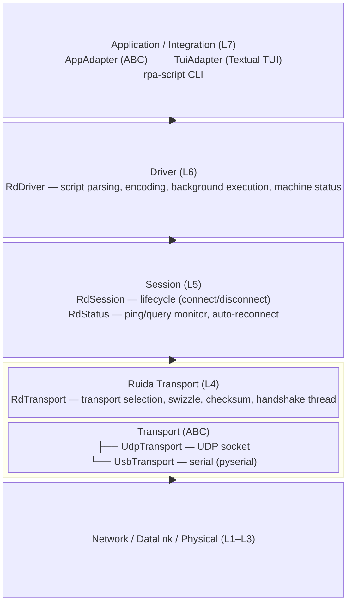
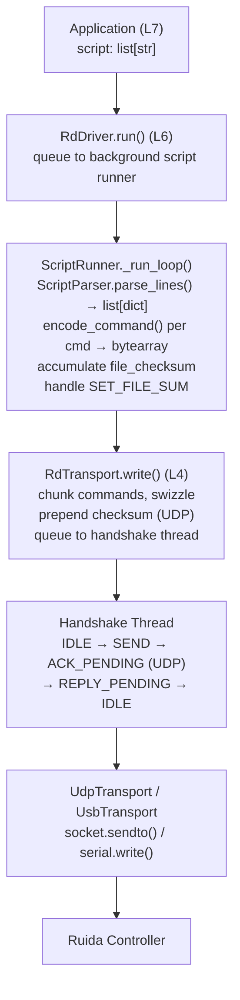
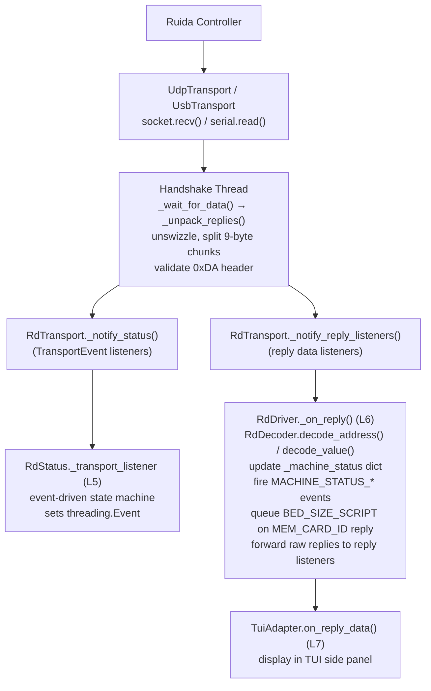
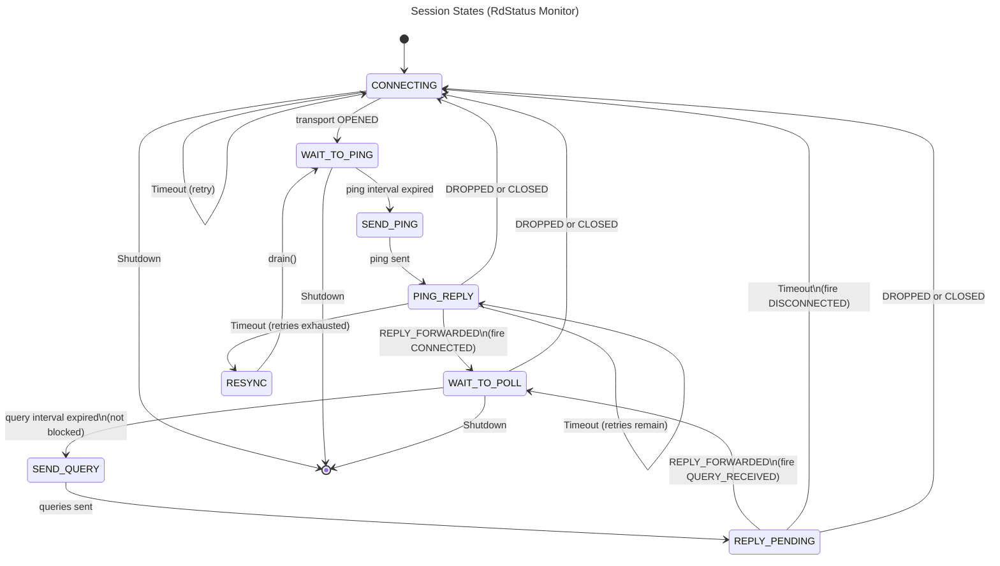
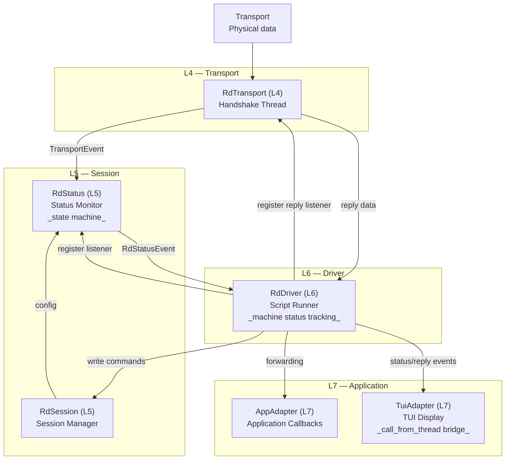

# Ruida Driver — Functional Specification (L4–L7)

> **Status:** Implemented  
> **Document type:** Functional specification (describes the system *as built*)  
> **See also:** [`RuidaDriver-design.md`](./RuidaDriver-design.md) for architectural intent and design rationale

---

## 1. Overview

The Ruida Driver is a layered Python library and toolchain for communicating with Ruida laser controllers (e.g., the RDC6442S). It provides:

- **Transport-agnostic communication** over UDP (Ethernet) or USB (serial), with automatic interface selection.
- **Connection lifecycle management** — automatic connect, ping-based health monitoring, and reconnect on failure.
- **Script execution** — human-readable `.rds` scripts (rpascript format) are parsed, encoded to Ruida binary commands, and transmitted to the controller.
- **Status monitoring** — periodic query commands poll controller memory for machine position, status bits, and card identity.
- **Event notification** — a layered listener model propagates transport events, session events, and reply data upward from the wire to the application.
- **Interactive TUI** — a Textual-based terminal application for interactive command entry, session management, and live status/reply display.
- **Script generation and round-trip testing** — decoded capture logs can be converted to `.rds` scripts, which can be replayed through the driver and verified against the original capture.

The driver conforms broadly to the OSI communications model, with layers L4 (Transport) through L7 (Application/Integration) implemented in Python.

---

## 2. Architecture

### 2.1 Layered Structure



### 2.2 Data Flow (Write Path)



### 2.3 Data Flow (Read Path)



---

## 3. L4 — Transport Layer

The Transport layer abstracts physical communication with the Ruida controller and handles Ruida-specific wire format details (swizzle, checksums, ACK handshake).

### 3.1 Transport Abstract Base — `Transport` (ABC)

**File:** `ruidadriver/transport/base.py`

An abstract base class defining the interface for all transport implementations. Designed to be called only from `RdTransport`.

| Method | Signature | Behavior |
|--------|-----------|----------|
| `open` | `(**kwargs) → bool` | Open the device. Returns `True` on success. No communication occurs at this point. |
| `close` | `() → None` | Close the transport. |
| `write` | `(packet: bytearray) → None` | Write a single packaged packet to the interface. |
| `read` | `(length: int) → Optional[bytes]` | Non-blocking read. Returns `None` if no data available. |
| `drain` | `() → None` | Discard all pending inbound data (for resync after errors). |
| `is_open` | *property* → `bool` | `True` when the transport is open. |
| `is_usb` | *property* → `bool` | `True` if this is a USB/serial transport. |
| `is_udp` | *property* → `bool` | `True` if this is a UDP transport. |

### 3.2 UDP Transport — `UdpTransport`

**File:** `ruidadriver/transport/udp_transport.py`

Implements `Transport` for UDP network communication.

- **`open(host, port=50200)`** — Creates a non-blocking UDP socket.
- **`write(packet)`** — Sends the packet via `socket.sendto()` to the configured host/port.
- **`read(length)`** — Calls `socket.recv()` with `MSG_DONTWAIT`. Returns `None` on `BlockingIOError`.
- **`drain()`** — Loops `read(65536)` until no more data.
- **`is_udp`** → `True`; **`is_usb`** → `False`.

### 3.3 USB Transport — `UsbTransport`

**File:** `ruidadriver/transport/usb_transport.py`

Implements `Transport` for USB/serial communication via `pyserial`. Requires the optional `serial` package.

- **`open(device)`** — Opens the serial port at 115200 baud, 8N1. The `device` parameter can be:
  - A plain device name (e.g., `ttyUSB0`) — prepends `/dev/` on POSIX.
  - A `<vid>:<pid>` signature — resolved via `serial.tools.list_ports.grep()`.
  - An absolute path — used directly.
  - Returns `False` if `pyserial` is not installed or the device cannot be opened.
- **`write(packet)`** — Writes via `serial.write()`.
- **`read(length)`** — Non-blocking read via `serial.read()`.
- **`drain()`** — Loops `serial.read(4096)` until empty.
- **`is_usb`** → `True`; **`is_udp`** → `False`.

### 3.4 Transport Events — `TransportEvent` Enum

**File:** `ruidadriver/transport_events.py`

```python
class TransportEvent(Enum):
    OPENED            # Transport successfully opened
    CLOSED            # Transport closed
    TIMEOUT           # Timeout while waiting for ACK or reply
    DROPPED           # Underlying link dropped unexpectedly
    ACK_RECEIVED      # UDP ACK byte (0xC6) received
    REPLY_RECEIVED    # GET_SETTING reply data received
    REPLY_FORWARDED   # Reply data unpacked and forwarded to listeners
    REPLY_ERROR       # Reply data did not pass validation
    UNEXPECTED_REPLY  # Reply has valid 0xDA header but unexpected second byte
```

### 3.5 Ruida Transport Coordinator — `RdTransport`

**File:** `ruidadriver/rd_transport.py`

`RdTransport` is the central L4 class. It wraps `UdpTransport` and `UsbTransport`, providing a unified interface for upper layers with automatic transport selection, swizzle packing, checksum calculation, and command/response sequencing via a dedicated handshake thread.

#### 3.5.1 Configuration

```python
def configure(
    udp_host: str = '',
    usb_device: str = '',
    magic: int = 0x88,
    chunk_size: int = 1024,
    timeout: int = 250,
    gross_timeout: int = 15000,
) -> None
```

Must be called before `open()`. Creates `UdpTransport` and/or `UsbTransport` instances based on the parameters. Setting both is valid — USB will be preferred at open time.

- `timeout`: Normal per-call timeout in milliseconds for waiting on ACK/reply.
- `gross_timeout`: Long timeout in milliseconds for operations during which the controller is unresponsive (e.g., home sequences).

#### 3.5.2 Connection

```python
def open() -> bool
```

Opens the preferred transport:
1. If `UsbTransport` was configured, attempts `usb.open(usb_device)`.
2. If USB fails or is not configured, attempts `UdpTransport.open(udp_host, 50200)`.
3. If both fail, returns `False`.

On success, starts the handshake thread and fires `TransportEvent.OPENED`.

```python
def close() -> None
```

Sets the shutdown event, joins the handshake thread (2s timeout), closes the underlying transport, and fires `TransportEvent.CLOSED`.

```python
def drain() -> None
```

Calls `transport.drain()` if the transport is open — used by the status monitor during resync.

#### 3.5.3 Write Path

```python
def write(commands: list[bytearray]) -> None
```

Accumulates encoded command bytearrays into a buffer. When adding a command would exceed `chunk_size`, packages the current buffer and queues it. After all commands are processed, packages any remaining buffer.

Each package is produced by `_package(data)`:
1. **Swizzle** the raw command bytes using `RpaSwizzler`.
2. If the active transport is **UDP**, prepend a 2-byte big-endian checksum: `struct.pack(">H", sum(swizzled_data) & 0xFFFF)`. The checksum is **not** swizzled.
3. If **USB**, no checksum is added; the swizzled bytes are used directly.

Packages are placed on `_send_queue` (a `queue.Queue`) for the handshake thread.

#### 3.5.4 Handshake Thread State Machine

The handshake thread implements a four-state machine for command/response sequencing:

```mermaid
---
title: Handshake States (RdTransport Thread)
---
stateDiagram-v2
    [*] --> IDLE

    IDLE --> SEND: Packet dequeued from send queue
    IDLE --> IDLE: Queue empty (200ms timeout)

    SEND --> ACK_PENDING: Packet sent; transport is UDP
    SEND --> REPLY_PENDING: Packet sent; transport is USB\nand GET_SETTING present
    SEND --> IDLE: Packet sent; transport is USB\nand no GET_SETTING

    ACK_PENDING --> REPLY_PENDING: 0xC6 ACK received\nand reply expected
    ACK_PENDING --> IDLE: 0xC6 ACK received\nand no reply expected
    ACK_PENDING --> IDLE: non-ACK data (REPLY_ERROR)
    ACK_PENDING --> IDLE: Timeout (TIMEOUT)

    REPLY_PENDING --> IDLE: Data received, unpacked,\nforwarded to listeners
    REPLY_PENDING --> IDLE: Timeout (TIMEOUT)

    IDLE --> [*]: Shutdown
```



**State transitions:**

| Current State | Event | Next State |
|---|---|---|
| `IDLE` | Packet dequeued from send queue | `SEND` |
| `IDLE` | Queue empty (200ms timeout) | `IDLE` (loop) |
| `IDLE` | Shutdown | Exit thread |
| `SEND` | Packet written; transport is UDP | `ACK_PENDING` |
| `SEND` | Packet written; transport is USB; packet has GET_SETTING | `REPLY_PENDING` |
| `SEND` | Packet written; transport is USB; no GET_SETTING | `IDLE` |
| `ACK_PENDING` | Received 0xC6 ACK byte; reply expected | `REPLY_PENDING` |
| `ACK_PENDING` | Received 0xC6 ACK byte; no reply expected | `IDLE` |
| `ACK_PENDING` | Received non-ACK data | `REPLY_ERROR` → `IDLE` |
| `ACK_PENDING` | Timeout | `TIMEOUT` → `IDLE` |
| `REPLY_PENDING` | Data received, unpacked, forwarded | `IDLE` |
| `REPLY_PENDING` | Timeout | `TIMEOUT` → `IDLE` |

**Note:** On failure transitions, the corresponding `TransportEvent` is fired to all status listeners before the state machine returns to `IDLE`.

#### 3.5.5 Read Path / Unpacking

```python
def _unpack_replies(data: bytes) -> list[bytearray]
```

1. **Unswizzle** the received data.
2. Split into 9-byte chunks (each `GET_SETTING` reply is 9 bytes).
3. Validate each chunk:
   - First byte must be `0xDA` (SETTING command); if not, fire `REPLY_ERROR` and truncate.
   - Second byte must be `0x01` (GET_SETTING sub-command); if not, fire `UNEXPECTED_REPLY` and truncate.
4. Valid chunks are collected and forwarded to reply listeners.

#### 3.5.6 Wait-for-Data with Gross Timeout

```python
def _wait_for_data(timeout_ms: int) -> Optional[bytes]
```

Polls `transport.read(65536)` in a 5ms polling loop until the deadline. If `_use_gross_timeout` is enabled, replaces the per-call timeout with `_gross_timeout` (default 15s). Returns `None` if the deadline expires or shutdown is detected; returns the raw bytes otherwise.

Gross timeout mode is toggled via `set_gross_timeout(state: bool)` and is used for long-running controller operations (home sequences, etc.).

#### 3.5.7 GET_SETTING Detection

```python
def _has_get_setting(packet: bytearray) -> bool
```

Scans the packaged packet for the two-byte marker `0xDA 0x01` to determine whether the handshake thread should expect a reply. This detection works on **unswizzled** data (before packing).

#### 3.5.8 Listener Registration

Support for multiple status and reply listeners with thread-safe add/remove:

```python
register_status_listener(listener: Callable[[TransportEvent], None])
unregister_status_listener(listener: Callable[[TransportEvent], None])
register_reply_listener(listener: Callable[[list[bytearray]], None])
unregister_reply_listener(listener: Callable[[list[bytearray]], None])
```

#### 3.5.9 Properties

| Property | Returns |
|---|---|
| `is_open` | `True` if transport is not `None` and `transport.is_open` |
| `is_usb` | Delegate to active transport |
| `is_udp` | Delegate to active transport |

---

## 4. L5 — Session Layer

The Session layer manages the connection lifecycle with a Ruida controller. It provides automatic connect/reconnect, periodic health monitoring via pings, and periodic status polling via query commands.

### 4.1 Session Status Events — `RdStatusEvent` Enum

**File:** `ruidadriver/rd_status.py`

```python
class RdStatusEvent(Enum):
    CONNECTED                # Controller responding to pings
    DISCONNECTED             # Controller not responding
    RECONNECTED              # Connection auto-restored after failure
    TERMINATED               # Session explicitly shut down
    BLOCKED                  # Status monitoring blocked (for command flow)
    UNBLOCKED                # Status monitoring resumed
    SCRIPT_ERROR             # Script encoding/parsing error
    PING_SENT                # Ping command transmitted
    PING_REPLIED             # Ping reply received
    QUERY_SENT               # Query command list transmitted
    QUERY_RECEIVED           # Query replies received
    MACHINE_STATUS_MOVING    # Machine is moving (bit 0)
    MACHINE_STATUS_PART_END  # Part end detected (bit 1)
    MACHINE_STATUS_JOB_RUNNING  # Job is running (bit 2)
```

### 4.2 Status Monitor — `RdStatus`

**File:** `ruidadriver/rd_status.py`

`RdStatus` runs a background daemon thread with an event-driven state machine that manages connection lifecycle and periodic status polling.

#### 4.2.1 Constructor

```python
RdStatus(
    transport: RdTransport,
    ping_cmd: Optional[bytearray] = None,
    ping_interval: int = 5000,         # ms between pings
    query_cmds: Optional[list[bytearray]] = None,
    connect_interval: int = 1000,      # ms between connect retries
    query_interval: int = 1000,        # ms between query cycles
)
```

#### 4.2.2 State Machine

The status monitor implements an 8-state machine. All states check for `_shutdown` and exit the thread immediately if set.



Detailed state behavior:

| State | Entry Action | Transitions |
|---|---|---|
| **CONNECTING** | If transport already open → `WAIT_TO_PING`. Otherwise call `transport.open()`, wait for `OPENED` event (up to `connect_interval`). | `OPENED` → `WAIT_TO_PING`; timeout → retry (loop back to CONNECTING); shutdown → exit. |
| **WAIT_TO_PING** | Wait `ping_interval` seconds, watching for transport events. | Timeout → `SEND_PING`; `DROPPED`/`CLOSED` → `CONNECTING`; shutdown → exit. |
| **SEND_PING** | Guard: if transport not open → `CONNECTING`. Send `ping_cmd` via `transport.write([ping_cmd])`. Fire `PING_SENT`. | → `PING_REPLY`. |
| **PING_REPLY** | Wait for `REPLY_FORWARDED` with retry loop (default 5 retries, 1s delay). | `REPLY_FORWARDED` → fire `PING_REPLIED` + `CONNECTED` → `WAIT_TO_POLL`; `DROPPED`/`CLOSED` → `CONNECTING`; timeout with retries → decrement, retry; exhausted → `RESYNC`. |
| **RESYNC** | Call `transport.drain()` to clear stale data. | → `WAIT_TO_PING`. |
| **WAIT_TO_POLL** | Wait `query_interval`. If blocked, loop `wait_until_unblocked(0.5s)` checking shutdown. | Timeout → `SEND_QUERY`; `DROPPED`/`CLOSED`/`TIMEOUT` → `CONNECTING`; shutdown → exit. |
| **SEND_QUERY** | Guard: if transport not open → `CONNECTING`. Send `query_cmds` via `transport.write(query_cmds)`. Fire `QUERY_SENT`. | → `REPLY_PENDING`. |
| **REPLY_PENDING** | If no `query_cmds` → `WAIT_TO_POLL` immediately. Wait for `REPLY_FORWARDED` (1s timeout). | `REPLY_FORWARDED` → fire `QUERY_RECEIVED` → `WAIT_TO_POLL`; `DROPPED`/`CLOSED` → `CONNECTING`; timeout → fire `DISCONNECTED` → `CONNECTING`. |

#### 4.2.3 Wait-for-Event Mechanism

```python
def _wait_for_event(
    timeout: float,
    expected_events: Optional[list[TransportEvent]] = None,
) -> Optional[TransportEvent]
```

Used by all states that need to wait for specific transport events with timeout:

1. A `threading.Event` (`_transport_event`) is set by `_transport_listener()` whenever `RdTransport` fires a `TransportEvent`.
2. `_wait_for_event` polls this event in 200ms inner-loop intervals (for shutdown responsiveness) up to the requested timeout.
3. When the event fires, it captures the event value and clears the event. If the event matches `expected_events`, it's returned. Unexpected events are silently ignored and waiting continues.
4. Returns `None` on full timeout or shutdown.
5. Default `expected_events` (when `None`) is `[DROPPED, CLOSED, TIMEOUT, REPLY_ERROR]` — ensuring responsiveness to transport failures even during simple delays.

#### 4.2.4 Block/Unblock Mechanism

```python
def block() -> None:      # Clear the unblock event, fire BLOCKED
def unblock() -> None:    # Set the unblock event, fire UNBLOCKED
def is_blocked -> bool:   # True when queries are blocked
def wait_until_unblocked(timeout=None) -> bool:  # Wait for unblock, return success
```

Cooperative blocking mechanism used by the Driver layer to prevent status queries from interleaving with command/reply sequences. The status monitor checks the block in `WAIT_TO_POLL` and loops waiting for unblock before proceeding to `SEND_QUERY`. The block/unblock state uses a `threading.Event`.

#### 4.2.5 Mutable Configuration

All configuration setters are thread-safe (via `_config_lock`):

| Method | Purpose |
|---|---|
| `set_ping_command(cmd)` | Set the ping command bytearray |
| `set_ping_interval(ms)` | Set ping interval (minimum 100ms; raises `ValueError` if smaller) |
| `set_query_commands(cmds)` | Set query command list |
| `set_query_interval(ms)` | Set query interval |
| `set_connect_interval(ms)` | Set connect retry interval |

Changes take effect on the next cycle (ping or query, respectively).

#### 4.2.6 Listener Management

```python
register_status_listener(listener: Callable[[RdStatusEvent], None])
unregister_status_listener(listener: Callable[[RdStatusEvent], None])
```

Thread-safe via `RLock`. Listeners are called from the monitor thread; each listener is wrapped in `try/except` to isolate failures.

#### 4.2.7 Lifecycle

```python
start()  # Start monitor thread (no-op if already running)
stop()   # Set shutdown, join thread (2s), unregister transport listener, fire TERMINATED
```

`stop()` is idempotent — safe to call multiple times. It sets `_shutdown` and unblocks any wait by also setting `_transport_event`.

#### 4.2.8 Connection Property

```python
is_connected -> bool  # True iff transport.is_open AND monitor thread is alive
```

### 4.3 Session Manager — `RdSession`

**File:** `ruidadriver/rd_session.py`

`RdSession` is a thin wrapper that combines `RdTransport` (L4) and `RdStatus` (L5) into a single session API.

#### 4.3.1 Constructor

```python
RdSession()
# Creates:
#   self.transport = RdTransport()    # public — for Through interface
#   self.status = RdStatus(transport=self.transport)  # public
```

#### 4.3.2 Lifecycle Methods

```python
def connect(timeout: int = 1000) -> bool
```

1. Idempotent — returns `True` immediately if already connected.
2. Registers a temporary status listener to catch `CONNECTED` (or `TERMINATED`) events.
3. Calls `self.transport.open()`.
4. Calls `self.status.start()`.
5. Waits for `CONNECTED` event within `timeout` milliseconds.
6. On success: returns `True`. On timeout: calls `disconnect()` and returns `False`.
7. Unregisters the temporary listener in a `finally` block.

```python
def disconnect() -> None
```

1. Calls `self.status.stop()` (idempotent).
2. Calls `self.transport.close()` (idempotent).

```python
def shutdown() -> None  # Alias for disconnect()
```

#### 4.3.3 Properties

| Property | Behavior |
|---|---|
| `is_connected` | Delegates to `self.status.is_connected` |
| `is_usb` | Delegates to `self.transport.is_usb` |
| `is_udp` | Delegates to `self.transport.is_udp` |

#### 4.3.4 Public Attributes (Through Interface)

- `transport` — Exposes `RdTransport` directly for the Driver layer to call `write()`.
- `status` — Exposes `RdStatus` for the Driver layer to configure ping/query commands and register listeners.

---

## 5. L6 — Driver Layer

The Driver layer interprets human-readable rpascript commands, encodes them to binary, and manages their transmission through the session stack. It also maintains internal machine status from reply data and forwards events to application-level listeners.

### 5.1 `RdDriver`

**File:** `ruidadriver/ruida_driver.py`

#### 5.1.1 Constructor

```python
RdDriver(session: RdSession)
```

Stores the session reference, initializes:
- `_script_queue`: `queue.Queue` for background script execution
- `_machine_status`: `dict[int, Any]` mapping memory addresses to decoded values
- `_status_listeners`, `_reply_listeners`: registered application callbacks

#### 5.1.2 Hardcoded Commands

```python
_PING_SCRIPT = ['GET_SETTING MEM_CARD_ID']
_QUERY_SCRIPT = [
    'GET_SETTING MEM_MACHINE_STATUS',
    'GET_SETTING MEM_CURRENT_POSITION_X',
    'GET_SETTING MEM_CURRENT_POSITION_Y',
    'GET_SETTING MEM_CURRENT_POSITION_Z',
    'GET_SETTING MEM_CURRENT_POSITION_U',
]
_BED_SIZE_SCRIPT = [
    'GET_SETTING MEM_BED_SIZE_X',
    'GET_SETTING MEM_BED_SIZE_Y',
]
```

#### 5.1.3 Script Runner Lifecycle

```python
def start_script_runner() -> None
```

1. Idempotent — no-op if runner is already alive.
2. Registers `_on_status_event` as an `RdStatus` listener.
3. Registers `_on_reply` as an `RdTransport` reply listener.
4. Parses `_PING_SCRIPT` and `_QUERY_SCRIPT` via `ScriptParser`, encodes each to binary via `encode_command`, and configures them on `self._session.status`.
5. Starts the status monitor: `self._session.status.start()`.
6. Creates and starts the background script runner thread (daemon).

```python
def stop_script_runner() -> None
```

1. Idempotent — no-op if already stopped.
2. Sets `_shutdown` event.
3. Puts `None` sentinel on `_script_queue` to unblock `get()`.
4. Joins the runner thread (2s timeout).
5. Unregisters listeners from `RdStatus` and `RdTransport`.
6. Sets `_runner_thread = None`.

#### 5.1.4 Background Script Runner (`_run_loop`)

```python
def _run_loop() -> None
```

A daemon thread that processes scripts from `_script_queue`:

1. Wait for a script on `_script_queue.get()` (blocking).
2. `None` sentinel → exit loop (shutdown).
3. Parse the script lines via `ScriptParser.parse_lines()`.
4. For each parsed command:
   - Skip `NEW_PACKET` directives.
   - Encode via `encode_command()`.
   - **File checksum handling**:
     - If `SET_FILE_SUM` with a value → store for verification.
     - If `SET_FILE_SUM` without a value → insert 5 zero-bytes placeholder, record index in `encoded` list.
     - If `should_include_in_checksum()` returns `True` → add `sum(raw)` to `file_checksum`.
     - Excluded: commands in `CHK_DISABLES` (0xA7 KEYPRESS, 0xDA SETTING) and `SET_FILE_SUM` itself.
5. **Post-loop checksum resolution**:
   - If `SET_FILE_SUM` had a value → verify against accumulated checksum. Raises `ValueError` on mismatch.
   - If `SET_FILE_SUM` had a placeholder → encode `file_checksum` as `uint35` and patch the last 5 bytes of the placeholder command's bytearray. `SET_FILE_SUM` without a value must appear in the final batch (not before a `NEW_PACKET` in the tshark pipeline); the `interpreter.py` variant validates this.
   - Duplicate `SET_FILE_SUM` raises `ValueError`.
6. **Transmission**:
   - If `session.is_connected` → `transport.write(encoded)`.
   - If not connected → re-queue the script to `_script_queue`, fire `DISCONNECTED` event.
7. Errors during any step are caught: `_notify_script_error()` fires `SCRIPT_ERROR` event and continues to the next script.

#### 5.1.5 Script Execution API

```python
def run(script: list[str]) -> None
```

Queues a script for background execution. Raises `RuntimeError("Script runner not started")` if the runner thread is not alive. Empty scripts are silently ignored.

#### 5.1.6 Reply Handling (`_on_reply`)

Called from the handshake thread for each batch of unpacked replies:

1. For each raw 9-byte reply:
   - Decode address via `RdDecoder.decode_address()`.
   - Decode value via `RdDecoder.decode_value()`.
   - Store in `_machine_status[address]`.
   - If address is `0x0400` (machine status): parse status bits into `MACHINE_STATUS_MOVING`, `MACHINE_STATUS_PART_END`, `MACHINE_STATUS_JOB_RUNNING` events and fire them.
   - If address is `0x057E` (card ID): queue `_BED_SIZE_SCRIPT` via `self.run()`.
2. Forward raw replies to all registered reply listeners.

#### 5.1.7 Machine Status Parsing

```python
def _parse_machine_status(value: int) -> list[RdStatusEvent]
```

Reads bit flags from the protocol's `MACHINE_STATUS_*` constants:
- Bit 0 → `MACHINE_STATUS_MOVING`
- Bit 1 → `MACHINE_STATUS_PART_END`
- Bit 2 → `MACHINE_STATUS_JOB_RUNNING`

#### 5.1.8 Listener Registration

```python
register_status_listener(listener: Callable[[RdStatusEvent], None])
register_reply_listener(listener: Callable[[list[bytearray]], None])
```

Thread-safe (RLock). Forwarding methods copy the listener list under lock and iterate outside the lock to avoid reentrancy issues. Each callback is wrapped in `try/except`.

#### 5.1.9 Properties

| Property | Returns |
|---|---|
| `session` | The underlying `RdSession` instance |
| `machine_status` | Read-only snapshot of `{address: decoded_value}` dict |

---

## 6. L7 — Application / Integration Layer

### 6.1 `AppAdapter` Abstract Base

**File:** `rpalib/app_adapter.py`

Abstract base class defining the interface for application-layer adapters.

```python
class AppAdapter(ABC):
    @abstractmethod
    def create_driver_and_session(self) -> None: ...

    @abstractmethod
    def on_status_event(self, event: Any) -> None: ...   # RdStatusEvent

    @abstractmethod
    def on_reply_data(self, replies: list[bytearray]) -> None: ...

    @abstractmethod
    def on_error(self, message: str) -> None: ...

    # Optional overrides:
    def run_script(self, script: list[str]) -> None:
        raise RuntimeError("Adapter not initialized.")

    def start(self) -> None: ...   # no-op
    def stop(self) -> None: ...    # no-op
```

Subclasses must implement the three callback methods and `create_driver_and_session()`. The `start()`/`stop()`/`run_script()` methods provide sensible defaults.

### 6.2 `TuiAdapter` — Textual TUI

**File:** `rpascript/tui_adapter.py`

A Textual-based terminal user interface that implements (duck-types) the `AppAdapter` interface and extends Textual's `App`.

#### 6.2.1 TUI Layout

```
┌─────────────────────────────────────────────────┐
│  Ruida Script TUI                    [Header]   │
├──────────────────────────┬──────────────────────┤
│                          │  [STATUS] CONNECTED   │
│  Log Area                │  [STATUS] PING_SENT   │
│  (RichLog, 1000 lines)   │  [REPLY] 0x057E: 42  │
│                          │                      │
│  [SCRIPT] session start  │  ── status/reply ──  │
│  [INFO] Connected...     │  side panel           │
│                          │                      │
│                          │  Events: 12           │
│                          │  Replies: 8           │
│                          │  Scripts: 3           │
├──────────────────────────┴──────────────────────┤
│  > Enter command...                    [Input]  │
├─────────────────────────────────────────────────┤
│  Ctrl+C Quit                                      │
│                                       [Footer]  │
└─────────────────────────────────────────────────┘
```

**CSS layout:**
- Main container: horizontal split (3fr log | 1fr side panel), `$primary` border.
- Log panel (left): `RichLog` (1000 lines, markup enabled) with `Input` docked at bottom.
- Side panel (right): status `RichLog`, reply `RichLog`, counter `Static`, divided by `$surface` borders.

#### 6.2.2 Key Bindings

| Binding | Action | Description |
|---|---|---|---|
| Ctrl+C | `quit` | Quit the TUI app |
| Escape | `stop` | Stop current operation (session connection or script execution) |

> All other TUI functions (help, load script, execute script, clear log, stop) are accessed via slash-prefixed commands (`/help`, `/load`, `/exec`, `/clear`, `/stop`) typed into the command input. See §6.2.5.

#### 6.2.3 Command Input Processing

On `Input.Submitted`, the input is dispatched in this order:

1. **Empty input** → ignored (no-op).
2. **`!` prefix** (e.g., `!session`, `!transport._package 0xAA`) → introspection mode. The rest of the line is parsed as an introspection expression: dotted path resolution against a named object map, optional space-separated arguments, optional parenthesized method call syntax. See §6.2.4.
3. **`?`** (exactly `?` as the entire input) → alias for `/help`. Shows help text.
4. **`/` prefix** (e.g., `/help`, `/load path/to/file.rds`) → slash-command dispatch. The command name (case-insensitive) is routed to its handler. Unknown commands produce an error message. See §6.2.5.
5. **Session start** (`session start udp=<IP> usb=<device> to=<timeout>`):
   - Guard: if session already active → log error, return.
   - `to` is an optional timeout parameter (e.g. `5s`, `5000ms`). Defaults to 5000ms if omitted. Invalid formats produce an error.
   - Create `RdSession`, call `transport.configure()`.
   - Call `session.connect(timeout=...)` in `run_in_executor` (to avoid blocking the TUI asyncio event loop), using the parsed timeout value.
   - On success: create `RdDriver`, register `self` as status and reply listeners, call `driver.start_script_runner()`.
   - On failure: log error, clean up session.
6. **Session end** (`session end`):
   - Guard: if no active session → log info, return.
   - Call `driver.stop_script_runner()`.
   - Call `session.disconnect()` in `run_in_executor`.
   - Idempotent.
7. **Regular command** (any rpascript line):
   - Guard: if no active session → log error, return.
   - Reconstruct via `reconstruct_script_line()`, call `driver.run([reconstructed])`.
   - Catch `RuntimeError` (runner not started), log error.

#### 6.2.4 Introspection Subsystem (`!` prefix)

The TUI provides an interactive introspection mode for inspecting and calling methods on internal objects at runtime.

**Object map** (lazy-resolved lambdas to handle `None` before session start):
- `session` → `RdSession` instance
- `transport` → `RdTransport` instance (via `session.transport`)
- `driver` → `RdDriver` instance
- `status` → `RdStatus` instance (via `session.status`)
- `parser` → `ScriptParser` instance
- `decoder` → `RdDecoder` instance
- `self` → the `TuiAdapter` instance itself

**Syntax:**

| Expression | Behavior | Example |
|---|---|---|
| `!<path>` | Show formatted value of the resolved object (multi-line for containers, literal breaks for docstrings) | `!session` |
| `!<path> <args...>` | Call the callable with space-separated, comma-delimited arguments | `!transport._package 0xAA` |
| `!<path>()` | Show `inspect.signature()` of the callable | `!decoder.decode_address()` |
| `!<path>(<args>)` | Call with parenthesized arguments | `!transport._package(0xD0, 0x1A, 0x00)` |
| `!self.<attr>` | Access TuiAdapter attributes | `!self._event_count` |

**Argument parsing** (in order of precedence):
1. `ast.literal_eval` — int, float, list, dict, None, True, False
2. Hex string → `bytearray.fromhex()` — e.g., `0xAA`, `0xDEADBE`
3. Fallback — treated as raw string

**Formatting:** The output starts with the expression in bold as a header line. The value is then displayed with:
- **Containers** (dicts, lists, tuples): one item per line with 2-space indentation
- **Docstrings** (multi-line strings): displayed with literal line breaks instead of `repr()` escape sequences
- **Other values**: `repr()` output as-is

#### 6.2.5 Slash Commands (`/` prefix)

All TUI meta-commands use the `/` prefix to distinguish them from Ruida controller commands and session lifecycle commands.

| Command | Handler | Description |
|---|---|---|
| `/help` or `?` | `_handle_help()` | Display formatted help text covering all three command categories |
| `/load <path>` | `_cmd_load(path)` | Load a `.rds` script file from disk into `_loaded_script` |
| `/head <path>` | `_cmd_head(path)` | Load a `.rds` script file to prepend to the job on `/exec job` |
| `/tail <path>` | `_cmd_tail(path)` | Load a `.rds` script file to append to the job on `/exec job` |
| `/exec [job]` | `_cmd_exec(args)` | Execute via `run_script()`: full script (no args) or filtered job (head+START_PROCESS→EOF+tail) with `job` argument |
| `/list [job\|script]` | `_cmd_list(args)` | Display composed job (head+job+tail) or loaded script in the main log |
| `/save job <path>` | `_cmd_save(args)` | Write composed job (head+job+tail) to a file |
| `/clear` | `_cmd_clear()` | Clear all log panels, loaded script, head, and tail |
| `/stop` | `_cmd_stop()` | Stop current operation (session connection or script execution). Also bound to Escape. |
| `/quit` | `_cmd_quit()` | Exit the TUI (`self.exit()`) |

**Error handling:**
- Unknown `/` commands: `"Unknown TUI command: /<cmd>. Type /help or ? for available commands."`
- `/load` / `/head` / `/tail` with no path: `"Usage: /load <path>"` / `"Usage: /head <path>"` / `"Usage: /tail <path>"`
- `/load` / `/head` / `/tail` file not found: `"File not found: <path>"`
- `/load` / `/head` / `/tail` permission denied: `"Permission denied: <path>"`
- `/load` / `/head` / `/tail` binary file: `"File is not a valid text file: <path>"`
- `/load` / `/head` / `/tail` empty file: `"File is empty or contains only blank lines: <path>"`
- `/exec` with no script loaded: `"No script loaded. Use /load <path> first."`
- `/exec` with no session: `"No active session. Use 'session start udp=...' first."`
- `/exec` with `job` action but no START_PROCESS/EOF markers: `"No job commands found (no START_PROCESS/EOF markers)."`
- `/exec` with unknown action: `"Unknown exec action: '<action>'. Usage: /exec [job]"`
- `/list` with unknown subcommand: `"Usage: /list [job|script]"`
- `/list script` with no script loaded: `"No script loaded. Use /load <path> first."`
- `/list job` with no script loaded: `"No script loaded. Use /load <path> first."`
- `/list job` with no job markers: `"No job commands found (no START_PROCESS/EOF markers)."`
- `/save` with incorrect syntax: `"Usage: /save job <path>"`
- `/save job` with no script loaded: `"No script loaded. Use /load <path> first."`
- `/save job` with no job markers: `"No job commands to save (no START_PROCESS/EOF markers)."`
- `/save job` permission denied: `"Permission denied: <path>"`
- `/save job` write error: `"Error writing <path>: <ErrorType>: <message>"`

**Case sensitivity:** All command names are case-insensitive (`/HELP`, `/Help`, `/help` all work).

**Job composition:** `/exec job`, `/list job`, and `/save job` all call the central `_build_job_script(self, lines)` method which composes `self._head_script + filtered_job + self._tail_script`. If no START_PROCESS/EOF markers are found, the method returns an empty list and callers report the error.

#### 6.2.6 Thread Bridge

The driver's status and reply callbacks fire from background threads. The TUI uses `call_from_thread()` to schedule widget updates on the asyncio event loop:

- **`on_status_event(event)`**: queues a lambda that writes to `_status_log` and updates the event counter.
- **`on_reply_data(replies)`**: queues a lambda that decodes each reply (address + value), writes to `_reply_log`, and updates the reply counter.
- **`on_error(message)`**: queues a lambda that writes an error to the log area.

#### 6.2.7 Session Cleanup on Exit

`on_exit()` ensures clean teardown when the user quits without explicitly typing `session end`:
1. Stop the driver script runner.
2. Disconnect the session.

#### 6.2.8 Entry Point

```python
# rpascript/tui_adapter.py
def run_tui() -> None:
    app = TuiAdapter()
    app.run()
```

### 6.3 `rpa-script` CLI

**File:** `rpascript/tui.py`

#### 6.3.1 Command Line Interface

```
usage: rpa-script [-h] [-o OUTPUT] [-n] [-t] [-v] [script]

Generate Ruida protocol output from .rds scripts or launch interactive TUI.

positional arguments:
  script                .rds script file to process

options:
  -h, --help            show this help message and exit
  -o, --output OUTPUT   Output file (default: stdout)
  -n, --dry-run         Parse only, show parsed commands
  -t, --tui             Launch interactive TUI
  -v, --version         Show version
```

#### 6.3.2 Execution Modes

1. **TUI mode** (`--tui`): Calls `run_tui()` from `tui_adapter.py`. Script argument is ignored with a note.
2. **Parse + tshark output** (script file provided): Parses the `.rds` file, creates `ScriptInterpreter`, writes tshark-format output to stdout or a file. The output can be piped to `rpa.py` for decode verification.
3. **Dry run** (`--dry-run`): Parses and displays the command tree without generating output.
4. **No arguments and no `--tui`**: Prints help and exits with code 1.

---

## 7. rpascript Format

### 7.1 File Format (`.rds`)

rpascript files are line-oriented plain text files with the following line types:

#### 7.1.1 Comments

```rds
# This is an inline comment
"""This is a block comment (triple-quote)"""
```

- Inline comments start with `#` outside quoted strings. The `#` character can be escaped as `\#` for literal usage (e.g., color values).
- Block comments are delimited by `"""` and can span multiple lines.

#### 7.1.2 Session Meta-Commands

```rds
session start udp=192.168.1.100 usb=none
session start usb=ttyUSB0
session start udp=192.168.1.100 usb=ttyUSB0   # Both valid, USB preferred
session start udp=192.168.1.100 to=10s         # With optional connection timeout
session start udp=192.168.1.100 to=5000ms      # Same, specified in milliseconds
session end
```

- `session start` requires at least one of `udp=` or `usb=`. Parameters set to `none` are treated as absent.
- `to=<timeout>` is an optional parameter specifying the connection timeout (e.g. `5s`, `5000ms`). Default is 5000ms.
- `session end` terminates the active session.

#### 7.1.3 NEW_PACKET Directive

```rds
NEW_PACKET
```

Indicates a packet boundary (used in tshark output generation to batch commands into packets).

#### 7.1.4 Regular Commands

```rds
CORE NOP
MOVE MOVE_ABS_XY X=100.000mm Y=200.000mm
CORE CMD SET_FILE_SUM = 12345
GET_SETTING MEM_CARD_ID  = 42
```

- **Optional type group**: One of `CORE`, `MOVE`, `LASER`, `CONFIG`, `QUERY`, `ENGRAVE`, `CUT`, `FILE`, `SYSTEM`.
- **Optional `CMD` keyword**: e.g., `CORE CMD NOP`.
- **Mnemonic**: The command name from the CT command table.
- **Parameters**: Space-separated, with optional `KEY=` prefix.
- **Expected value** (optional): Separated by `=` from parameters, used for synthetic reply generation in tshark output.

### 7.2 Recognized Type Groups

```python
TYPE_NAMES = frozenset({
    'CORE', 'MOVE', 'LASER', 'CONFIG', 'QUERY',
    'ENGRAVE', 'CUT', 'FILE', 'SYSTEM',
})
```

Type names are resolved via `ScriptParser._resolve_type()`, which also accepts the `_CMD` suffix (e.g., `CORE_CMD`).

### 7.3 Line Reconstruction

`reconstruct_script_line(cmd)` converts a parsed command dict back to rpascript text format, preserving session meta-commands, `NEW_PACKET`, and regular commands with their parameters and expected values.

---

## 8. Encoding Pipeline

### 8.1 Pipeline Stages

```
Text (rpascript .rds line)
    │
    ▼
ScriptParser.parse_lines()          Parse to command dict
    │
    ▼
encode_command(cmd, mnemonic_map,   Resolve mnemonic, encode prefix/opcode/params
                mt_map, encoder)
    │
    ▼
encode_params(param_specs, values)  Encode each parameter per its spec
    │
    ▼
encode_single_param()               Parse value token → call RdEncoder method
    │
    ▼
bytearray (raw, unswizzled)
    │
    ▼
RdTransport._package()              Swizzle + optional UDP checksum
    │
    ▼
Transport.write(packet)             Send to wire (UDP socket / serial)
```

### 8.2 Encoder Maps

**`_ENCODER_MAP`** — Maps decoder function names (from CT param specs) to `RdEncoder` methods:

| Decoder Name | Encoder Method | Description |
|---|---|---|
| `int7` | `encode_int7` | Signed 7-bit integer |
| `uint7` | `encode_uint7` | Unsigned 7-bit integer |
| `int14` | `encode_int14` | Signed 14-bit integer |
| `uint14` | `encode_uint14` | Unsigned 14-bit integer |
| `int35` | `encode_int35` | Signed 35-bit integer |
| `uint35` | `encode_uint35` | Unsigned 35-bit integer |
| `coord` | `encode_coord` | Coordinate (byte count from `rd_type`) |
| `cstring` | `encode_cstring` | C-string (null-terminated) |
| `string8` | `encode_string8` | 8-byte fixed string |
| `power` | `encode_power` | Laser power value |
| `frequency` | `encode_frequency` | Laser frequency |
| `speed` | `encode_speed` | Move speed |
| `time` | `encode_time` | Time value |
| `bool` / `on_off` | `encode_bool` | Boolean value |
| `rapid` | `encode_uint7` | Rapid move (aliased to uint7) |
| `mt` | `encode_mt` | Memory address mnemonic |
| `index` | `encode_index` | Index value |
| `checksum` / `card_id` | `encode_uint35` | Aliased to uint35 |
| `tbd` | `None` | Unknown — returns empty bytearray |

**`_RDTYPE_ENCODER_MAP`** — Fallback map from Ruida type names (DTYP from param specs) to encoder methods, used when the decoder function name is not in `_ENCODER_MAP`.

### 8.3 Parameter Value Parsing

`parse_value(token, decoder_fn, rd_type)` handles:

- **Booleans**: `ON`, `TRUE`, `1` → `True`; `OFF`, `FALSE`, `0` → `False`.
- **Coordinates**: Strips `mm`/`MM` suffix.
- **Power**: Strips `%` suffix.
- **Frequency**: Strips `KHz`/`kHz` suffix.
- **Speed**: Strips `mm/S`/`mm/s` suffix.
- **Time**: Strips `mS`/`ms`/`MS` suffix.
- **Strings**: Strips surrounding quotes for `cstring`.
- **Hex**: `#FF00FFFF` → `int`; `0x1234` → `int`.
- **Numeric**: `int()` then `float()` fallback.
- **Fallback**: Returns the raw string.

### 8.4 Memory Address Encoding

`encode_mt_param(value_token, mt_map)` looks up mnemonic strings (e.g., `MEM_CARD_ID`) in the MT table and returns the 2-byte MSB/LSB address pair.

### 8.5 File Checksum Logic

The file checksum is a running sum of `sum(raw)` for all commands that pass `should_include_in_checksum()`. Excluded commands:
- Those with prefix in `CHK_DISABLES` (0xA7 KEYPRESS, 0xDA SETTING).
- The `SET_FILE_SUM` command itself (0xE5 → 0x05).

**Verification mode**: When `SET_FILE_SUM` has a value parameter, the accumulated checksum is compared against that value after all commands are processed. Mismatch raises `ValueError`.

**Placeholder mode**: When `SET_FILE_SUM` has no value parameter, 5 zero bytes are inserted as a placeholder. After the checksum is fully accumulated, the placeholder bytes are patched with the encoded `uint35` checksum value. In the tshark output path (`ScriptInterpreter`), the placeholder must be in the final batch (before any `NEW_PACKET` after it), otherwise a `ValueError` is raised.

**Duplicate detection**: At most one `SET_FILE_SUM` per file. Duplicates raise `ValueError`.

---

## 9. Event and Listener Model

### 9.1 Event Flow Diagram



### 9.2 Listener Types

| Source | Event Type | Listener Signature | Registered By |
|---|---|---|---|
| `RdTransport` | `TransportEvent` | `Callable[[TransportEvent], None]` | `RdStatus` (via `_transport_listener`) |
| `RdTransport` | `list[bytearray]` | `Callable[[list[bytearray]], None]` | `RdDriver` (via `_on_reply`) |
| `RdStatus` | `RdStatusEvent` | `Callable[[RdStatusEvent], None]` | `RdDriver` + application |
| `RdDriver` | `RdStatusEvent` | `Callable[[RdStatusEvent], None]` | Application (e.g., `TuiAdapter`) |
| `RdDriver` | `list[bytearray]` | `Callable[[list[bytearray]], None]` | Application (e.g., `TuiAdapter`) |

### 9.3 Thread Safety

- All listener lists are protected by locks (RLock or threading.Lock).
- Listeners are always called on a snapshot copy of the list (copy-on-iterate).
- Each listener callback is wrapped in `try/except` to prevent one faulty callback from crashing the notification thread.
- Status/reply callbacks from background threads to the TUI use `call_from_thread()` for safe asyncio widget updates.

---

## 10. Error Handling and Edge Cases

### 10.1 Layer-by-Layer Guard Clauses

| Layer | Guards |
|---|---|
| **L4 Transport** | `_wait_for_data()` checks `_shutdown` before each poll iteration. `_unpack_replies()` validates 0xDA header and 0x01 sub-byte, truncating on mismatch. |
| **L4 Handshake** | Timeouts fire `TIMEOUT` event and return to `IDLE`. Shutdown detected in any state via `_shutdown_event`. |
| **L5 Status** | Every state function checks `_shutdown` before and after `_wait_for_event`. Transport not open → `CONNECTING`. `SEND_PING` and `SEND_QUERY` guard against missing commands (None/empty). `PING_REPLY` has retry loop with exhaustion → `RESYNC`. |
| **L5 Session** | `connect()` clears `_connected_event` before starting. `timeout` parameter has millisecond interface (converted to seconds for `Event.wait()`). Temporary listener unregistered in `finally`. |
| **L6 Driver** | `run()` raises `RuntimeError` if runner not started. Empty scripts are no-ops. `_run_loop` catches all exceptions (`except Exception`) and fires `SCRIPT_ERROR`. Duplicate `SET_FILE_SUM` raises `ValueError`. Checksum mismatch raises `ValueError`. Disconnected → requeue script. |
| **L7 TUI** | Guard on missing session before command dispatch. `run_in_executor` for blocking calls. `on_exit` cleanup. Stale session state guarded by none-check. |

### 10.2 Connection Failure Handling

1. **Transport open failure**: `RdTransport.open()` returns `False` when both USB and UDP fail. `RdStatus` retries at `connect_interval` (default 1s).
2. **Ping failure**: After 5 retries (1s delay each), the status monitor transitions to `RESYNC`, draining the transport, then returns to `WAIT_TO_PING` to restart the ping cycle.
3. **Query failure**: A single timeout in `REPLY_PENDING` fires `DISCONNECTED` and transitions to `CONNECTING`, which may reconnect using a different transport.
4. **Session connect timeout**: `RdSession.connect()` returns `False`; the TUI logs an error and cleans up.

### 10.3 Transport Drop / Unexpected Close

Handled at all levels:
- `RdStatus._wait_for_event()` defaults include `DROPPED` and `CLOSED` for responsiveness.
- Any state detecting `DROPPED`/`CLOSED` transitions to `CONNECTING`.
- The `REPLY_ERROR` and `UNEXPECTED_REPLY` events are fired to status listeners for diagnostics but do not trigger a full disconnect.

### 10.4 Checksum Edge Cases

- **Duplicate SET_FILE_SUM**: Detected and raised as `ValueError("Duplicate SET_FILE_SUM — at most one per file")`.
- **SET_FILE_SUM before NEW_PACKET**: In tshark output mode, if the placeholder SET_FILE_SUM is in a batch that was already flushed (before a NEW_PACKET marker), the patch fails with a descriptive `ValueError`.
- **SET_FILE_SUM value mismatch**: Detected and raised as `ValueError` with both the expected and actual values.

### 10.5 Stale Session State

- `RdSession.connect()` checks `is_connected` first; returns `True` immediately if already connected (idempotent).
- `RdDriver.start_script_runner()` checks `_runner_thread.is_alive()`; no-op if already running (idempotent).
- `RdDriver.stop_script_runner()` checks `_runner_thread is None`; no-op if already stopped (idempotent).
- `RdStatus.stop()` checks `_monitor_thread` aliveness; idempotent.

### 10.6 Script Runner Disconnect Handling

When the runner thread detects that the session is not connected, it:
1. Re-queues the script to `_script_queue` (preserving it for retry after reconnect).
2. Fires `DISCONNECTED` event to registered status listeners.

This prevents script loss during transient disconnections.

### 10.7 Session Start / Stop Error Cases

| Scenario | Error/Info Message |
|---|---|
| `_start_session` with invalid `to=` format | `"Invalid timeout format: '...'"` |
| `_start_session` with `to=` timeout | `"Session connection timeout"` + teardown |
| Session start cancelled by user (`/stop` or Escape during connect) | `"Session start cancelled by user"` + teardown |
| `/stop` with nothing to stop | `"Nothing to stop"` |

### 10.8 Gross Timeout for Long Operations

When the controller executes long operations (home sequences, power-on self-tests), it may be unresponsive for several seconds. The `gross_timeout` mode replaces the normal per-call timeout with a longer value (default 15s) at both `RdTransport` and `RdStatus` levels:

```python
# Enable before long operation
transport.set_gross_timeout(True)
driver.run(['...home command...'])
transport.set_gross_timeout(False)
```

---

## 11. Script Generation (Round-Trip)

### 11.1 `ScriptGenerator`

**File:** `rpascript/generator.py`

Converts decoded Ruida parser output (from `rpa.py`) to `.rds` script format for round-trip testing.

**Callback interface:**
- `write_command(label, cmd_values, param_list, command, sub_command, decoded, cmd_n)` — Called once per decoded host→controller command. Buffers the command line until a reply callback arrives on the same `cmd_n`, then appends `= <reply_value>`.
- `on_new_packet()` — Called once per host→controller packet. Writes a `NEW_PACKET` marker between packets.

**Formatting details:**
- Power parameters use `{:.3f}` format (not `{:.1f}`) for lossless round-trip of all 16,384 uint14 power values.
- TBD-type parameters are emitted as raw integer values.
- Parameters containing `#` are escaped as `\#`.
- Whitespace in parameter values is collapsed to single spaces.

---

## 12. Dependencies

| Package | Required | Purpose |
|---|---|---|
| `bokeh` | Yes | Plotting (decoding visualization, not part of driver core) |
| `textual` | Yes | TUI framework for `TuiAdapter` |
| `pyserial` | Optional | USB/serial transport (`UsbTransport`) |
| `selenium` | Optional | PNG export via Bokeh |

---

## 13. Directory Structure

```
ruidadriver/
    rd_transport.py       # RdTransport (L4 coordinator)
    transport_events.py   # TransportEvent enum
    transport/
        __init__.py       # Re-exports Transport, UdpTransport, UsbTransport
        base.py           # Transport ABC
        udp_transport.py  # UdpTransport
        usb_transport.py  # UsbTransport
    rd_status.py          # RdStatus (L5 status monitor)
    rd_session.py         # RdSession (L5 session manager)
    ruida_driver.py       # RdDriver (L6 driver)

rpascript/
    encoding.py           # Pure encoding functions
    interpreter.py        # ScriptParser, ScriptInterpreter
    generator.py          # ScriptGenerator (decode→.rds)
    tui_adapter.py        # TuiAdapter (L7 TUI)
    cli.py                # rpa-script CLI entry point

rpalib/
    app_adapter.py        # AppAdapter ABC (L7 interface)
    ruida_transcoder.py   # RdEncoder, RdDecoder

protocols/ruida/
    ruida_protocol.py     # CT, MT, IDXT, RT command tables
```

---

*End of functional specification.*
